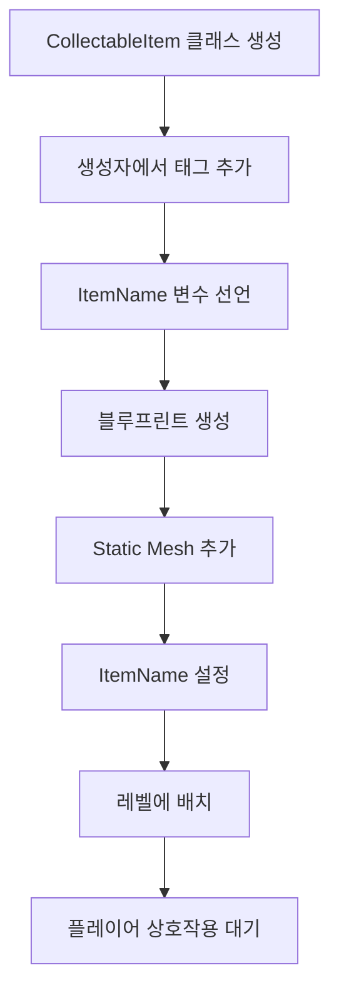

# { C++ 델리게이트(Delegate)를 사용한 압력판 시스템 구현 }

## 📚 강의 개요

이 강의에서는 Unreal Engine의 델리게이트 시스템을 사용하여 압력판(Pressure Plate) 기능을 구현하는 방법을 학습합니다.

---

## 🎯 학습 목표

- 델리게이트(Delegate)의 개념 이해
- 오버랩 이벤트 처리 방법
- 함수 바인딩(Function Binding) 구현
- 선택적 기능 구현 (Optional Feature)

---

## 💡 델리게이트란?

### 기본 개념

- **델리게이트**: 특정 이벤트가 발생했을 때 자동으로 실행되는 함수 연결 시스템
- **이벤트**: 게임에서 특정 상황이 발생하면 발동 (예: 액터 충돌, 오버랩 등)

### 작동 원리

```
1. 델리게이트 발생 (예: 플레이어가 트리거에 진입)
   ↓
2. 바인딩된 함수 자동 호출
   ↓
3. 원하는 동작 실행 (예: 문 열기)
```

---

## 🔧 주요 델리게이트

### 1. OnComponentBeginOverlap

- **발동 시점**: 컴포넌트와 오버랩이 **시작**될 때
- **용도**: 플레이어가 트리거 영역에 **진입**할 때

### 2. OnComponentEndOverlap

- **발동 시점**: 컴포넌트와 오버랩이 **종료**될 때
- **용도**: 플레이어가 트리거 영역에서 **벗어날** 때

---

## 📝 코드 구현 단계

### Step 1: 헤더 파일 작성 (TriggerComponent.h)

```cpp
// ========================================
// 델리게이트 바인딩용 함수 선언부
// ========================================

// UFUNCTION() 매크로 설명:
// - 이 함수를 언리얼 엔진의 리플렉션 시스템에 등록합니다
// - 델리게이트에 바인딩하려면 반드시 UFUNCTION()이 필요합니다
// - 이게 없으면 AddDynamic()이 작동하지 않습니다
UFUNCTION()
void OnOverlapBegin(
    // OverlappedComp: 충돌이 감지된 우리 쪽 컴포넌트
    // 예: 트리거의 Box Component
    UPrimitiveComponent* OverlappedComp,

    // OtherActor: 우리 트리거와 충돌한 상대방 액터
    // 예: 플레이어 캐릭터, 큐브, 공 등
    AActor* OtherActor,

    // OtherComp: 충돌한 상대방 액터의 컴포넌트
    // 예: 플레이어의 Capsule Component
    UPrimitiveComponent* OtherComp,

    // OtherBodyIndex: 충돌한 물리 바디의 인덱스 번호
    // (고급 물리 시뮬레이션에서 사용, 초보자는 무시해도 됨)
    int32 OtherBodyIndex,

    // bFromSweep: 이 충돌이 "스윕(Sweep)" 동작에서 발생했는지 여부
    // Sweep = 물체가 이동하면서 경로상의 충돌을 체크하는 것
    // true: 움직이면서 충돌 감지됨
    // false: 겹친 상태로 시작됨
    bool bFromSweep,

    // SweepResult: 충돌에 대한 상세 정보를 담은 구조체
    // 충돌 지점, 법선 벡터, 거리 등의 정보 포함
    // const FHitResult& = "변경 불가능한 FHitResult 구조체의 참조"
    const FHitResult& SweepResult
);

// ========================================
// 오버랩 종료 함수 선언
// ========================================

// OnOverlapEnd: 오버랩이 끝날 때 호출되는 함수
// (플레이어가 트리거 영역에서 벗어날 때)
UFUNCTION()
void OnOverlapEnd(
    // OverlappedComp: 충돌이 해제된 우리 쪽 컴포넌트
    UPrimitiveComponent* OverlappedComp,

    // OtherActor: 트리거를 벗어난 액터
    AActor* OtherActor,

    // OtherComp: 벗어난 액터의 컴포넌트
    UPrimitiveComponent* OtherComp,

    // OtherBodyIndex: 물리 바디 인덱스
    int32 OtherBodyIndex

    // 주의: OnOverlapEnd는 OnOverlapBegin보다 파라미터가 2개 적습니다
    // bFromSweep과 SweepResult가 없음 (종료 시에는 불필요)
);

// ========================================
// 압력판 기능 활성화 변수
// ========================================

// UPROPERTY(EditAnywhere) 설명:
// - EditAnywhere: 언리얼 에디터의 어디서든 이 변수를 편집 가능
//   * 블루프린트 에디터에서 편집 가능
//   * 레벨 에디터의 디테일 패널에서 편집 가능
// - 이 매크로가 없으면 에디터에서 변수가 보이지 않습니다
UPROPERTY(EditAnywhere)
bool IsPressurePlate = false;  // 기본값: false (압력판 기능 꺼짐)
    // true로 설
```

### 📌 함수 시그니처 설명

- `UFUNCTION()`: 언리얼 엔진에 함수 등록 (델리게이트 사용 필수)
- **인수 설명**:
  - `OverlappedComp`: 오버랩된 컴포넌트
  - `OtherActor`: 충돌한 액터
  - `OtherComp`: 충돌한 액터의 컴포넌트
  - 기타: 충돌 상세 정보

---

### Step 2: BeginPlay에서 델리게이트 바인딩

```cpp
// ========================================
// BeginPlay: 게임이 시작될 때 자동으로 호출되는 함수
// ========================================
void UTriggerComponent::BeginPlay()
{
    // Super::BeginPlay() 설명:
    // - Super = 부모 클래스 (UActorComponent)
    // - 부모 클래스의 BeginPlay()를 먼저 실행
    // - 부모의 초기화 작업을 완료한 후 우리 코드 실행
    // - 반드시 맨 처음에 호출해야 합니다!
    Super::BeginPlay();

    // ========================================
    // 1단계: Mover 컴포넌트 찾기
    // ========================================

    // MoverActor가 null이 아닌지 확인 (안전성 체크)
    // MoverActor = 에디터에서 설정한 "움직일 액터"
    // nullptr 체크를 하지 않으면 게임이 크래시될 수 있습니다!
    if (MoverActor != nullptr)
    {
        // FindComponentByClass<UMover>() 설명:
        // - MoverActor 안에서 UMover 타입의 컴포넌트를 찾습니다
        // - <UMover> = 템플릿 문법, "UMover 타입을 찾아라"
        // - 찾으면: Mover 포인터에 저장
        // - 못 찾으면: nullptr 반환
        Mover = MoverActor->FindComponentByClass<UMover>();

        // 실행 예시:
        // MoverActor = "문(Door) 액터"
        // FindComponentByClass<UMover>()
        // → 문 액터 안의 Mover 컴포넌트를 찾아서
        // → Mover 변수에 저장
    }

    // ========================================
    // 2단계: 델리게이트 바인딩 (조건부)
    // ========================================

    // IsPressurePlate가 true인지 확인
    // true = 압력판 기능 활성화 → 델리게이트 바인딩
    // false = 일반 트리거 → 바인딩 안 함
    if (IsPressurePlate)
    {
        // ====================================
        // 오버랩 시작 이벤트 바인딩
        // ====================================

        // OnComponentBeginOverlap:
        // - 언리얼 엔진이 제공하는 델리게이트
        // - Box Component와 뭔가 겹치기 시작하면 발동
        // - 예: 플레이어가 트리거 영역에 진입
        OnComponentBeginOverlap.AddDynamic(
            // 첫 번째 파라미터: this
            // - this = 현재 객체 자신 (UTriggerComponent 인스턴스)
            // - "이 객체의 함수를 호출해라"는 의미
            this,

            // 두 번째 파라미터: &UTriggerComponent::OnOverlapBegin
            // - & = 주소 연산자 (함수의 메모리 주소)
            // - UTriggerComponent:: = 클래스 이름과 범위 지정
            // - OnOverlapBegin = 호출할 함수 이름
            //
            // 전체 의미: "이 클래스의 OnOverlapBegin 함수 주소"
            &UTriggerComponent::OnOverlapBegin
        );

        // 실행 흐름:
        // 1. 플레이어가 트리거에 진입
        // 2. OnComponentBeginOverlap 델리게이트 발동
        // 3. OnOverlapBegin() 함수 자동 호출
        // 4. Mover->ShouldMove = true 실행

        // ====================================
        // 오버랩 종료 이벤트 바인딩
        // ====================================

        // OnComponentEndOverlap:
        // - 언리얼 엔진이 제공하는 델리게이트
        // - Box Component와 겹침이 끝나면 발동
        // - 예: 플레이어가 트리거 영역에서 벗어남
        OnComponentEndOverlap.AddDynamic(
            // this: 현재 TriggerComponent 객체
            this,

            // OnOverlapEnd 함수의 주소
            // 오버랩이 끝나면 이 함수가 호출됩니다
            &UTriggerComponent::OnOverlapEnd
        );

        // 실행 흐름:
        // 1. 플레이어가 트리거를 벗어남
        // 2. OnComponentEndOverlap 델리게이트 발동
        // 3. OnOverlapEnd() 함수 자동 호출
        // 4. Mover->ShouldMove = false 실행
    }
    // IsPressurePlate가 false면:
    // - 위의 if 블록을 건너뜀
    // - 델리게이트 바인딩 안 함
    // - 오버랩 이벤트에 반응하지 않음
}
```

### 📌 AddDynamic 파라미터 설명

1. **this**: 현재 객체 인스턴스
2. **&클래스명::함수명**: 바인딩할 함수의 주소
   - `&` (앰퍼샌드): 주소 연산자

---

### Step 3: 오버랩 함수 구현

```cpp
// 오버랩 시작 (플레이어 진입)
void UTriggerComponent::OnOverlapBegin(
    UPrimitiveComponent* OverlappedComp,
    AActor* OtherActor,
    UPrimitiveComponent* OtherComp,
    int32 OtherBodyIndex,
    bool bFromSweep,
    const FHitResult& SweepResult
)
{
    if (Mover)  // Mover가 유효한지 확인
    {
        Mover->ShouldMove = true;  // 이동 활성화
    }
}

// 오버랩 종료 (플레이어 퇴장)
void UTriggerComponent::OnOverlapEnd(
    UPrimitiveComponent* OverlappedComp,
    AActor* OtherActor,
    UPrimitiveComponent* OtherComp,
    int32 OtherBodyIndex
)
{
    if (Mover)  // Mover가 유효한지 확인
    {
        Mover->ShouldMove = false;  // 이동 비활성화
    }
}
```

---

## 🎮 작동 흐름

```
1. BeginPlay 실행
   ↓
2. IsPressurePlate == true?
   ↓ (Yes)
3. 델리게이트에 함수 바인딩
   ↓
4. 플레이어가 트리거 진입
   ↓
5. OnComponentBeginOverlap 발동
   ↓
6. OnOverlapBegin 함수 호출
   ↓
7. Mover->ShouldMove = true
   ↓
8. 플레이어가 트리거 퇴장
   ↓
9. OnComponentEndOverlap 발동
   ↓
10. OnOverlapEnd 함수 호출
    ↓
11. Mover->ShouldMove = false
```

---

## ⚙️ 선택적 기능 구현

### IsPressurePlate 변수

```cpp
UPROPERTY(EditAnywhere)
bool IsPressurePlate = false;
```

### 특징

- **EditAnywhere**: 에디터에서 편집 가능
- **기본값**: false (압력판 기능 비활성화)
- **목적**: 모든 트리거가 압력판일 필요는 없으므로 선택 가능하게 구현

### 사용 효과

- `IsPressurePlate = true`: 압력판으로 작동
- `IsPressurePlate = false`: 일반 트리거로 작동

---

## 🔑 핵심 개념 정리

### 1. 델리게이트 바인딩

- **목적**: 이벤트와 함수를 연결
- **방법**: `AddDynamic(객체, 함수주소)`

### 2. UFUNCTION 매크로

- **필수 사용**: 델리게이트 시스템에 함수 등록
- **역할**: 언리얼 리플렉션 시스템에 함수 등록

### 3. 함수 시그니처

- **중요성**: 델리게이트가 요구하는 정확한 파라미터 필요
- **출처**: 언리얼 공식 문서 참조

### 4. 포인터 검증

```cpp
if (Mover)  // nullptr 체크 필수!
{
    // 안전한 사용
}
```

---

## 🎓 실습 과제

### 과제 내용

1. `IsPressurePlate` 변수 생성
2. BeginPlay에서 if 문으로 조건부 바인딩
3. 압력판 기능 테스트

### 해결 방법

```cpp
// 헤더 파일
UPROPERTY(EditAnywhere)
bool IsPressurePlate = false;

// cpp 파일
if (IsPressurePlate)
{
    // 델리게이트 바인딩
}
```

---

## 📖 참고 자료

- Unreal Engine C++ API 문서
- 델리게이트 시스템 공식 문서: [docs.claude.com](https://docs.claude.com/)

---

## ✅ 체크리스트

- [ ] 델리게이트 개념 이해
- [ ] UFUNCTION 매크로 사용법
- [ ] AddDynamic 함수 사용법
- [ ] 함수 시그니처 작성
- [ ] 포인터 검증 습관화
- [ ] 선택적 기능 구현

---

## 💭 추가 학습 포인트

### 왜 함수 주소를 사용하나요?

- 델리게이트는 함수 자체가 아닌 **함수의 위치**를 저장
- `&` 연산자로 메모리 주소 전달

### this 키워드의 의미

- 현재 객체 자신을 가리키는 포인터
- 클래스 내부에서 자기 자신을 참조할 때 사용

### 델리게이트의 강점

- 코드 분리 (이벤트 발생과 처리 로직 분리)
- 재사용성
- 유연한 시스템 구축

---

## 🚀 다음 단계

다음 강의에서는 더 복잡한 델리게이트 활용과 게임 시스템 구현을 학습합니다!

# { Unreal Engine 태그 시스템을 활용한 액터 필터링 }

## 📚 강의 개요

이 강의에서는 Unreal Engine의 **태그(Tag) 시스템**을 사용하여 특정 액터만 압력판을 활성화할 수 있도록 필터링하는 방법을 학습합니다.

---

## 🎯 학습 목표

- 태그 시스템의 개념과 용도 이해
- 액터에 태그 추가하는 방법
- 코드에서 태그 확인하는 방법
- 조건부 로직으로 액터 필터링 구현

---

## 🚨 문제 상황

### 현재 코드의 문제점

```cpp
void UTriggerComponent::OnOverlapBegin(...)
{
    if (Mover)
    {
        Mover->ShouldMove = true;  // 모든 액터가 활성화 가능!
    }
}
```

**문제:**

- 플레이어든, 의자든, 상자든 **모든 액터**가 압력판을 활성화
- 의도하지 않은 객체가 문을 열 수 있음
- 게임 로직이 예상과 다르게 작동

**실제 예시:**

```
1. 의자에 물리 시뮬레이션 적용
2. 의자가 트리거에 떨어짐
3. 압력판 활성화 (원하지 않는 동작!)
```

---

## 💡 해결 방법: 태그 시스템

### 태그(Tag)란?

- **정의**: 액터에 붙일 수 있는 텍스트 문자열 식별자
- **용도**: 코드에서 특정 액터를 식별하고 필터링
- **장점**: 간단하고 유연한 액터 분류 시스템

### 작동 원리

```
1. 원하는 액터에 태그 추가 (예: "PressurePlateActivator")
   ↓
2. 오버랩 발생 시 액터의 태그 확인
   ↓
3. 올바른 태그가 있는 경우에만 압력판 활성화
```

---

## 🎨 에디터에서 태그 추가하기

### Step 1: 블루프린트 열기

```
1. Content Browser → My Assets 폴더
2. BP_Player 더블클릭
3. 블루프린트 에디터 열림
```

### Step 2: 액터 태그 찾기

```
1. BP_Player 선택 (루트)
2. Details 패널에서 아래로 스크롤
3. "Actor" 섹션 찾기
4. "Advanced" (고급) 섹션 펼치기
5. "Tags" 또는 "Actor Tags" 찾기
```

### Step 3: 태그 추가

```
1. "Actor Tags" 옆의 ➕ 버튼 클릭
2. 새 태그 입력: "PressurePlateActivator"
3. 저장 및 컴파일

```


### 📌 주의사항

### Actor Tags vs Component Tags

```
✅ Actor Tags: 액터 전체에 대한 태그 (우리가 사용)
❌ Component Tags: 특정 컴포넌트에 대한 태그 (다른 용도)

```

### 태그 관리

```cpp
// 태그 추가
Actor Tags: [0] "PressurePlateActivator"

// 태그 삭제
태그 옆의 ▼ 클릭 → Delete 선택

// 여러 태그 가능
Actor Tags:
  [0] "PressurePlateActivator"
  [1] "Player"
  [2] "Movable"

```

---

## 💻 코드 구현

### Step 1: 태그 확인 함수 사용

```cpp
void UTriggerComponent::OnOverlapBegin(
    UPrimitiveComponent* OverlappedComp,
    AActor* OtherActor,  // ← 충돌한 액터
    UPrimitiveComponent* OtherComp,
    int32 OtherBodyIndex,
    bool bFromSweep,
    const FHitResult& SweepResult
)
{
    // ActorHasTag() 함수로 태그 확인
    bool HasTag = OtherActor->ActorHasTag("PressurePlateActivator");

    // 태그가 없으면 즉시 종료
    if (!HasTag) return;

    // 태그가 있는 경우에만 실행
    if (Mover)
    {
        Mover->ShouldMove = true;
    }
}
```

---

## 🔍 코드 상세 분석

### 1. OtherActor 파라미터

```cpp
AActor* OtherActor
```

- **타입**: AActor 포인터
- **의미**: 트리거와 충돌한 액터
- **예시**:
  - 플레이어 캐릭터
  - 물리 시뮬레이션 의자
  - 상자, 공 등

### 2. ActorHasTag() 함수

```cpp
OtherActor->ActorHasTag("PressurePlateActivator");
```

### 함수 설명

- **반환 타입**: `bool` (true/false)
- **파라미터**: `FName` 타입의 태그 이름
- **작동**:
  - 액터에 해당 태그가 있으면 `true` 반환
  - 태그가 없으면 `false` 반환

### 포인터 접근 연산자

```cpp
OtherActor->ActorHasTag(...)
//        ^^
//        화살표 연산자 (->)

// 포인터인 경우: -> 사용
AActor* MyActor = ...;
MyActor->ActorHasTag(...);

// 포인터가 아닌 경우: . 사용
AActor MyActor = ...;
MyActor.ActorHasTag(...);
```

### 3. Early Return 패턴

```cpp
if (!HasTag) return;
```

### 의미

- `!HasTag` = "HasTag가 false라면" = "태그가 없다면"
- `return` = 함수 즉시 종료
- 아래 코드 실행 안 함

### 효과적인 코드 구조

```cpp
// ❌ 비효율적 (중첩 if문)
if (HasTag)
{
    if (Mover)
    {
        Mover->ShouldMove = true;
    }
}

// ✅ 효율적 (Early Return)
if (!HasTag) return;

if (Mover)
{
    Mover->ShouldMove = true;
}
```

### 4. 불필요한 변수 제거

```cpp
// 방법 1: 변수 사용 (더 읽기 쉬움)
bool HasTag = OtherActor->ActorHasTag("PressurePlateActivator");
if (!HasTag) return;

// 방법 2: 직접 사용 (더 간결함)
if (!OtherActor->ActorHasTag("PressurePlateActivator")) return;
```

**강의에서는 방법 1 사용** (초보자가 이해하기 쉬움)

---

## 📝 전체 코드 (주석 포함)

```cpp
// ========================================
// 오버랩 시작 함수 (태그 필터링 추가)
// ========================================
void UTriggerComponent::OnOverlapBegin(
    UPrimitiveComponent* OverlappedComp,
    AActor* OtherActor,  // 충돌한 액터
    UPrimitiveComponent* OtherComp,
    int32 OtherBodyIndex,
    bool bFromSweep,
    const FHitResult& SweepResult
)
{
    // ====================================
    // 1단계: 태그 확인
    // ====================================

    // ActorHasTag() 함수로 태그 유무 확인
    // "PressurePlateActivator" 태그가 있는지 검사
    bool HasTag = OtherActor->ActorHasTag("PressurePlateActivator");

    // ====================================
    // 2단계: 태그가 없으면 즉시 종료
    // ====================================

    // !HasTag = HasTag가 false일 때 (태그 없음)
    // return = 함수 즉시 종료, 아래 코드 실행 안 함
    if (!HasTag) return;

    // 여기까지 왔다면 HasTag가 true (태그 있음)

    // ====================================
    // 3단계: Mover 활성화 (태그가 있는 경우만)
    // ====================================

    // Mover 포인터가 유효한지 확인
    if (Mover)
    {
        // 압력판 활성화 → 문 열림
        Mover->ShouldMove = true;
    }
}

// ========================================
// 오버랩 종료 함수 (태그 필터링 추가)
// ========================================
void UTriggerComponent::OnOverlapEnd(
    UPrimitiveComponent* OverlappedComp,
    AActor* OtherActor,  // 벗어난 액터
    UPrimitiveComponent* OtherComp,
    int32 OtherBodyIndex
)
{
    // ====================================
    // 1단계: 태그 확인
    // ====================================

    // 오버랩 시작과 동일한 태그 확인
    bool HasTag = OtherActor->ActorHasTag("PressurePlateActivator");

    // ====================================
    // 2단계: 태그가 없으면 즉시 종료
    // ====================================

    // 태그가 없는 액터는 무시
    if (!HasTag) return;

    // ====================================
    // 3단계: Mover 비활성화 (태그가 있는 경우만)
    // ====================================

    if (Mover)
    {
        // 압력판 비활성화 → 문 닫힘
        Mover->ShouldMove = false;
    }
}
```

---

## 🎮 작동 시나리오

### 시나리오 1: 플레이어 (태그 있음)

```
1. 플레이어가 트리거 진입
   ↓
2. OnOverlapBegin 호출
   ↓
3. OtherActor = 플레이어
   ↓
4. ActorHasTag("PressurePlateActivator") → true
   ↓
5. HasTag = true
   ↓
6. if (!HasTag) return; → 실행 안 됨 (조건 false)
   ↓
7. Mover->ShouldMove = true 실행
   ↓
8. 문 열림! ✅
```

### 시나리오 2: 의자 (태그 없음)

```
1. 의자가 트리거에 떨어짐
   ↓
2. OnOverlapBegin 호출
   ↓
3. OtherActor = 의자
   ↓
4. ActorHasTag("PressurePlateActivator") → false
   ↓
5. HasTag = false
   ↓
6. if (!HasTag) return; → 실행됨! (조건 true)
   ↓
7. 함수 즉시 종료
   ↓
8. Mover->ShouldMove = true 실행 안 됨
   ↓
9. 문 안 열림! ✅
```

### 시나리오 3: 의자에 태그 추가

```
1. 의자 선택 → Details → Actor Tags
2. "PressurePlateActivator" 태그 추가
3. 이제 의자도 압력판 활성화 가능!
```

---

## 🔧 물리 객체 설정 (참고)

### 의자를 물리 객체로 만들기

```
1. Static Mesh 선택
2. Details 패널
3. Physics 섹션:
   ✅ Simulate Physics (물리 시뮬레이션)
   Mass: 30 (가벼운 무게)
4. Collision 섹션:
   ✅ Generate Overlap Events (오버랩 이벤트 생성)
   ※ 이것이 없으면 오버랩 감지 안 됨!
```


---

## 💭 실습 과제

### 과제 내용

`OnOverlapEnd` 함수에도 동일한 태그 체크 로직 추가

### 해결 과정

```cpp
void UTriggerComponent::OnOverlapEnd(...)
{
    // 1. 태그 확인
    bool HasTag = OtherActor->ActorHasTag("PressurePlateActivator");

    // 2. 태그 없으면 종료
    if (!HasTag) return;

    // 3. 태그 있으면 비활성화
    if (Mover)
    {
        Mover->ShouldMove = false;
    }
}
```

---

## 🎓 핵심 개념 정리

### 1. 태그 시스템

```cpp
// 태그 추가 (에디터)
Actor Tags: "PressurePlateActivator"

// 태그 확인 (코드)
OtherActor->ActorHasTag("PressurePlateActivator")
```

### 2. Early Return 패턴

```cpp
// 조건을 만족하지 않으면 즉시 종료
if (!condition) return;

// 장점:
// - 중첩 if문 감소
// - 코드 가독성 향상
// - 불필요한 실행 방지
```

### 3. 포인터 연산자

```cpp
// 포인터: ->
AActor* MyActor;
MyActor->ActorHasTag(...);

// 일반 객체: .
AActor MyActor;
MyActor.ActorHasTag(...);
```

### 4. 태그 이름의 중요성

```cpp
// ❌ 오타 발생 시 작동 안 함
OtherActor->ActorHasTag("PressurePlateActivater");  // 오타!

// ✅ 정확한 이름
OtherActor->ActorHasTag("PressurePlateActivator");

// 💡 팁: 에디터에서 복사-붙여넣기 사용!
```

---

## 🚀 확장 아이디어

### 여러 태그 사용

```cpp
// 플레이어만
if (OtherActor->ActorHasTag("Player"))

// 무거운 물체만
if (OtherActor->ActorHasTag("HeavyObject"))

// 적 캐릭터만
if (OtherActor->ActorHasTag("Enemy"))
```

### 여러 태그 중 하나라도 있으면

```cpp
bool IsPlayer = OtherActor->ActorHasTag("Player");
bool IsHeavy = OtherActor->ActorHasTag("HeavyObject");

if (IsPlayer || IsHeavy)  // OR 조건
{
    // 플레이어 또는 무거운 물체
    Mover->ShouldMove = true;
}
```

### 여러 태그 모두 필요한 경우

```cpp
bool IsPlayer = OtherActor->ActorHasTag("Player");
bool HasKey = OtherActor->ActorHasTag("HasKey");

if (IsPlayer && HasKey)  // AND 조건
{
    // 플레이어이면서 열쇠를 가진 경우만
    Mover->ShouldMove = true;
}
```

---

## ✅ 체크리스트

- [ ] 태그 시스템의 개념 이해
- [ ] 에디터에서 태그 추가 방법
- [ ] `ActorHasTag()` 함수 사용법
- [ ] Early Return 패턴 이해
- [ ] 포인터 연산자 구분 (`>` vs `.`)
- [ ] 태그 이름 정확성의 중요성
- [ ] Actor Tags vs Component Tags 구분

---

## 💡 실전 활용 예시

### 게임 시나리오

```
1. 보스방 입장 트리거
   → "Player" 태그만 반응

2. 무게 압력판
   → "HeavyObject" 태그만 반응

3. 적 전용 함정
   → "Enemy" 태그만 반응

4. 열쇠 필요 문
   → "Player" + "HasKey" 태그 둘 다 필요

```

---

## 📖 다음 단계

- 더 복잡한 태그 조합 사용
- 태그 기반 퍼즐 시스템 구현
- 동적 태그 추가/제거

---

## 🎓 마무리

> 태그 시스템은 간단하지만 강력한 액터 필터링 도구입니다. 문자열 하나로 복잡한 게임 로직을 간단하게 구현할 수 있습니다!

# { C++ 논리 AND 연산자 (&&)를 활용한 코드 최적화 }

## 🎯 학습 목표

- 논리 AND 연산자(`&&`) 개념과 사용법
- 중첩 if문을 단일 조건으로 간소화
- 단락 평가(Short-circuit)를 활용한 안전한 포인터 체크

---

## 🚨 발견된 문제

### 이전 코드의 실수

```cpp
void UTriggerComponent::OnOverlapBegin(...)
{
    bool HasTag = OtherActor->ActorHasTag("PressurePlateActivator");
    //            ^^^^^^^^^
    //            포인터 유효성 체크 없이 바로 사용! (위험!)
}

```

**문제점:**

- `OtherActor`가 `nullptr`일 수 있음
- nullptr에 함수 호출 시 크래시 발생
- 포인터는 항상 사용 전에 검증 필요!

---

## 💡 논리 AND 연산자 (`&&`)

### 기본 문법

```cpp
bool result = 좌측값 && 우측값;

```

### 진리표

```cpp
true  && true   → true   // 양쪽 모두 참일 때만 참
true  && false  → false
false && true   → false
false && false  → false

```

### 핵심 특징: **단락 평가 (Short-circuit)**

```cpp
// 왼쪽이 false면 오른쪽은 평가하지 않음!
false && (어떤코드)  → 오른쪽 실행 안 함

// 왼쪽이 true일 때만 오른쪽 평가
true && (어떤코드)   → 오른쪽도 평가함

```

---

## 🔧 코드 개선 과정

### Before: 중첩 if문 (3단계)

```cpp
void UTriggerComponent::OnOverlapBegin(...)
{
    if (OtherActor)  // 1단계
    {
        if (OtherActor->ActorHasTag("PressurePlateActivator"))  // 2단계
        {
            if (Mover)  // 3단계
            {
                Mover->ShouldMove = true;
            }
        }
    }
}

```

### After: 논리 AND 연산자 활용

```cpp
void UTriggerComponent::OnOverlapBegin(...)
{
    // nullptr 체크 추가 (안전장치)
    if (!OtherActor) return;

    // 태그 확인
    bool HasTag = OtherActor->ActorHasTag("PressurePlateActivator");
    if (!HasTag) return;

    // Mover 활성화
    if (Mover)
    {
        Mover->ShouldMove = true;
    }
}

```

### 최종 최적화 버전 (보너스)

```cpp
void UTriggerComponent::OnOverlapBegin(...)
{
    // 단일 조건으로 통합
    if (OtherActor && OtherActor->ActorHasTag("PressurePlateActivator"))
    {
        if (Mover)
        {
            Mover->ShouldMove = true;
        }
    }
}

```

---

## 📝 단락 평가의 중요성

### 안전한 포인터 체크

```cpp
// ✅ 안전: 왼쪽에서 nullptr 체크
if (MyActor && MyActor->ActorHasTag("Tag"))
//  ^^^^^^^   ^^^^^^^^^^^^^^^^^^^^^^^
//  1. 먼저 체크   2. true일 때만 실행

// 실행 흐름:
// 1. MyActor가 nullptr? → false → 단락! (오른쪽 실행 안 함)
// 2. MyActor가 유효? → true → 오른쪽도 평가

```

### 크래시 방지 메커니즘

```cpp
AActor* MyActor = nullptr;

// ❌ 크래시 발생
if (MyActor->ActorHasTag("Tag"))  // nullptr->함수() = 💥

// ✅ 안전
if (MyActor && MyActor->ActorHasTag("Tag"))
//  ^^^^^^^ false → 오른쪽 실행 안 함 → 안전!

```

---

## 🎯 핵심 정리

### 1. 논리 AND (`&&`)

```cpp
true && true   → true
true && false  → false
false && ?     → false (오른쪽 평가 안 함)

```

### 2. 단락 평가 (Short-circuit)

```cpp
// 왼쪽이 false면 오른쪽 실행 안 함
if (false && ExpensiveFunction())  // ExpensiveFunction() 호출 안 됨!

```

### 3. 포인터 체크 패턴

```cpp
// ✅ 안전한 패턴
if (Pointer && Pointer->Function())

// ❌ 위험한 패턴
if (Pointer->Function())  // Pointer가 nullptr이면 크래시

```

### 4. Early Return

```cpp
// 조건 불만족 시 즉시 종료
if (!Condition) return;

// 이후 코드는 Condition이 true일 때만 실행됨

```

---

## ✅ 체크리스트

- [ ] `&&` 연산자는 양쪽 모두 true일 때만 true
- [ ] 단락 평가: 왼쪽이 false면 오른쪽 실행 안 함
- [ ] 포인터는 항상 사용 전에 nullptr 체크
- [ ] `if (!Pointer) return;` 패턴 활용
- [ ] 중첩 if문 → 논리 AND로 간소화 가능

---

## 💡 한 줄 요약

> && 연산자의 단락 평가를 활용하면 포인터를 안전하게 체크하면서 코드를 간결하게 만들 수 있다!

## { 실무에서 가장 많이 사용되는 스타일 }

### 🏆 **Early Return 스타일** (가장 선호됨)

```cpp
void UTriggerComponent::OnOverlapBegin(...)
{
    // 1. 빠른 검증 (Guard Clauses)
    if (!OtherActor) return;
    if (!OtherActor->ActorHasTag("PressurePlateActivator")) return;
    if (!Mover) return;

    // 2. 실제 로직 (중첩 없이 깔끔)
    Mover->ShouldMove = true;
}

```

### 📊 선호 순위

1. **Early Return** (70%) ⭐⭐⭐⭐⭐
   - 가독성 최고
   - 중첩 최소화
   - 에러 케이스 먼저 처리
2. **단일 AND 조건** (20%)

   ```cpp
   if (OtherActor && OtherActor->ActorHasTag("Tag") && Mover)
   {
       Mover->ShouldMove = true;
   }

   ```

   - 짧은 로직에 적합

3. **중첩 if문** (10%)
   - 레거시 코드에서 가끔 보임
   - 현대적 스타일 아님

---

### 💡 실무 팁

```cpp
// ✅ 추천: Early Return
if (!IsValid()) return;
if (!HasPermission()) return;
DoWork();

// ❌ 비추천: 깊은 중첩
if (IsValid()) {
    if (HasPermission()) {
        if (CanDo()) {
            DoWork();
        }
    }
}
```

**결론: Early Return 스타일을 사용하세요!**

# { 코드 리팩터링: 중복 제거와 재사용 가능한 함수 만들기 }

## 🎯 학습 목표

- 코드 리팩터링의 필요성 이해
- 중복 코드를 함수로 추출하는 방법
- 상태 관리 변수 활용
- 불필요한 함수 호출 방지

---

## 🚨 문제 상황

### 기존 코드의 중복

```cpp
// OnOverlapBegin
void UTriggerComponent::OnOverlapBegin(...)
{
    if (Mover)
    {
        Mover->ShouldMove = true;  // 중복 1
    }
}

// OnOverlapEnd
void UTriggerComponent::OnOverlapEnd(...)
{
    if (Mover)
    {
        Mover->ShouldMove = false;  // 중복 2
    }
}
```

**문제점:**

- 같은 로직이 두 곳에 반복됨
- 수정 시 두 곳 모두 변경해야 함
- 유지보수 어려움
- 버그 발생 가능성 증가

---

## 💡 해결 방법: 함수 추출

### 리팩터링 전략

```
1. 공통 로직 파악
2. 재사용 가능한 함수로 추출
3. 상태 관리 변수 추가
4. 불필요한 중복 호출 방지
```

---

## 📝 코드 구현

### Step 1: 상태 변수 추가

```cpp
// TriggerComponent.h
class CRYPTRAIDER_API UTriggerComponent : public UBoxComponent
{
    GENERATED_BODY()

public:
    // 트리거 상태를 저장하는 변수
    UPROPERTY(VisibleAnywhere)
    bool IsTriggered = false;  // 기본값: false (비활성)
};
```

**IsTriggered 역할:**

- 현재 트리거가 활성화되어 있는지 추적
- 중복 호출 방지용 플래그
- 디버깅 시 에디터에서 확인 가능

---

### Step 2: 재사용 가능한 함수 생성

```cpp
// TriggerComponent.h
void Trigger(bool NewTriggerValue);  // 함수 선언

// TriggerComponent.cpp
void UTriggerComponent::Trigger(bool NewTriggerValue)
{
    // ========== 상태 업데이트 ==========
    IsTriggered = NewTriggerValue;

    // ========== Mover 제어 ==========
    if (Mover)
    {
        // IsTriggered 값을 Mover에 전달
        Mover->ShouldMove = IsTriggered;
    }
    else
    {
        // 에러 로깅 (디버깅용)
        UE_LOG(LogTemp, Warning,
            TEXT("%s has no Mover to trigger"),
            *GetOwner()->GetActorNameOrLabel());
    }
}
```

---

### Step 3: 중복 호출 방지

```cpp
void UTriggerComponent::OnOverlapBegin(...)
{
    // 기본 검증
    if (!OtherActor) return;
    if (!OtherActor->ActorHasTag("PressurePlateActivator")) return;

    // ========== 핵심: 중복 방지 ==========
    // 이미 트리거되어 있으면 다시 호출 안 함
    if (IsTriggered) return;

    // 처음 트리거될 때만 실행
    Trigger(true);
}

void UTriggerComponent::OnOverlapEnd(...)
{
    // 기본 검증
    if (!OtherActor) return;
    if (!OtherActor->ActorHasTag("PressurePlateActivator")) return;

    // ========== 핵심: 중복 방지 ==========
    // 이미 비활성화되어 있으면 다시 호출 안 함
    if (!IsTriggered) return;

    // 활성화 상태일 때만 비활성화
    Trigger(false);
}
```

---

## 🔍 상세 분석

### 1. Trigger() 함수 파라미터

```cpp
void Trigger(bool NewTriggerValue)
```

**NewTriggerValue:**

- `true`: 트리거 활성화 (문 열림)
- `false`: 트리거 비활성화 (문 닫힘)

**장점:**

- 하나의 함수로 양방향 제어
- 코드 중복 제거
- 확장성 향상

---

### 2. 중복 호출 방지 로직

```cpp
// OnOverlapBegin
if (IsTriggered) return;  // 이미 ON이면 다시 ON 안 함
Trigger(true);

// OnOverlapEnd
if (!IsTriggered) return;  // 이미 OFF면 다시 OFF 안 함
Trigger(false);
```

**시나리오:**

```
1. 플레이어 진입 → IsTriggered = false → Trigger(true) 실행
2. 플레이어가 여전히 안에 있음 → IsTriggered = true → 중복 호출 방지
3. 다른 물체 추가 진입 → IsTriggered = true → 중복 호출 방지
4. 플레이어 퇴장 (다른 물체는 남음) → IsTriggered = true → Trigger(false) 실행

```

---

### 3. 에러 로깅

```cpp
if (Mover)
{
    Mover->ShouldMove = IsTriggered;
}
else
{
    // Mover가 없을 때 경고 출력
    UE_LOG(LogTemp, Warning,
        TEXT("%s has no Mover to trigger"),
        *GetOwner()->GetActorNameOrLabel());
}
```

**GetOwner()->GetActorNameOrLabel():**

- 이 컴포넌트를 소유한 액터의 이름 반환
- 어느 트리거에서 문제가 발생했는지 식별 가능

**출력 예시:**

```
TriggerBox_1 has no Mover to trigger
```

---

## 📊 Before vs After

### Before: 중복 코드

```cpp
// OnOverlapBegin
if (Mover) { Mover->ShouldMove = true; }

// OnOverlapEnd
if (Mover) { Mover->ShouldMove = false; }

// 문제:
// - 같은 로직 2번 작성
// - 수정 시 2곳 변경 필요
// - 중복 호출 방지 없음
```

### After: 리팩터링

```cpp
// 공통 함수
void Trigger(bool NewValue)
{
    IsTriggered = NewValue;
    if (Mover) { Mover->ShouldMove = IsTriggered; }
}

// OnOverlapBegin
if (!IsTriggered) Trigger(true);

// OnOverlapEnd
if (IsTriggered) Trigger(false);

// 장점:
// - 로직 한 곳에 집중
// - 수정 시 한 번만 변경
// - 중복 호출 자동 방지

```

---

## 🎮 실행 흐름

### 시나리오 1: 정상 작동

```
1. IsTriggered = false (초기 상태)
   ↓
2. 플레이어 진입
   ↓
3. OnOverlapBegin 호출
   ↓
4. if (!IsTriggered) → true (0번째 진입)
   ↓
5. Trigger(true) 실행
   - IsTriggered = true
   - Mover->ShouldMove = true
   ↓
6. 문 열림! ✅

```

### 시나리오 2: 중복 방지

```
1. IsTriggered = true (이미 활성화)
   ↓
2. 다른 물체 추가 진입
   ↓
3. OnOverlapBegin 호출
   ↓
4. if (!IsTriggered) → false (이미 true)
   ↓
5. return; (함수 종료)
   ↓
6. Trigger() 호출 안 됨 ✅ (중복 방지)

```

### 시나리오 3: 비활성화

```
1. IsTriggered = true (활성화 상태)
   ↓
2. 플레이어 퇴장
   ↓
3. OnOverlapEnd 호출
   ↓
4. if (IsTriggered) → true (활성화 중)
   ↓
5. Trigger(false) 실행
   - IsTriggered = false
   - Mover->ShouldMove = false
   ↓
6. 문 닫힘! ✅

```

---

## 💻 최종 코드 (주석 포함)

```cpp
// ========================================
// 트리거 제어 함수 (핵심 로직)
// ========================================
void UTriggerComponent::Trigger(bool NewTriggerValue)
{
    // 1. 상태 업데이트
    IsTriggered = NewTriggerValue;

    // 2. Mover 제어
    if (Mover)
    {
        // IsTriggered 값을 Mover에 동기화
        Mover->ShouldMove = IsTriggered;
    }
    else
    {
        // 디버깅: Mover가 없을 때 경고
        UE_LOG(LogTemp, Warning,
            TEXT("%s has no Mover to trigger"),
            *GetOwner()->GetActorNameOrLabel());
    }
}

// ========================================
// 오버랩 시작 (활성화)
// ========================================
void UTriggerComponent::OnOverlapBegin(...)
{
    // 기본 검증
    if (!OtherActor) return;
    if (!OtherActor->ActorHasTag("PressurePlateActivator")) return;

    // 중복 방지: 이미 트리거되어 있으면 무시
    if (IsTriggered) return;

    // 처음 트리거될 때만 활성화
    Trigger(true);
}

// ========================================
// 오버랩 종료 (비활성화)
// ========================================
void UTriggerComponent::OnOverlapEnd(...)
{
    // 기본 검증
    if (!OtherActor) return;
    if (!OtherActor->ActorHasTag("PressurePlateActivator")) return;

    // 중복 방지: 이미 비활성화되어 있으면 무시
    if (!IsTriggered) return;

    // 활성화 상태일 때만 비활성화
    Trigger(false);
}

```

---

## 🎓 리팩터링 원칙

### 1. DRY (Don't Repeat Yourself)

```cpp
// ❌ 반복
OnOverlapBegin: if (Mover) { Mover->ShouldMove = true; }
OnOverlapEnd:   if (Mover) { Mover->ShouldMove = false; }

// ✅ 재사용
Trigger(bool value) { if (Mover) Mover->ShouldMove = value; }

```

### 2. 단일 책임 원칙

```cpp
// Trigger() 함수의 단일 책임:
// "트리거 상태를 변경하고 Mover에 전달"

// 델리게이트 함수의 책임:
// "조건 검증 후 Trigger() 호출"

```

### 3. 확장성

```cpp
// 나중에 추가 기능 쉽게 구현
void Trigger(bool NewValue)
{
    IsTriggered = NewValue;
    if (Mover) { Mover->ShouldMove = IsTriggered; }

    // 추가 기능 예시:
    // PlaySound();
    // SpawnParticles();
    // UpdateUI();
}

```

---

## ⚠️ 주의사항

### Q: 왜 태그 체크는 Trigger()에 안 넣나요?

```cpp
// ❌ 이렇게 하면 안 되는 이유:
void Trigger(bool NewValue, AActor* OtherActor)
{
    if (!OtherActor->ActorHasTag("...")) return;
    // ...
}

// 문제:
// 1. Trigger()는 다른 곳에서도 사용될 예정
// 2. 다른 곳에서는 OtherActor가 없을 수 있음
// 3. 태그 체크는 델리게이트 함수에만 필요한 로직

```

**결론:** 컨텍스트에 특화된 검증은 호출하는 쪽에서 처리!

---

## ✅ 체크리스트

- [ ] 중복 코드를 함수로 추출
- [ ] 상태 관리 변수 활용 (`IsTriggered`)
- [ ] 중복 호출 방지 로직 구현
- [ ] 에러 로깅으로 디버깅 지원
- [ ] DRY 원칙 적용
- [ ] 단일 책임 원칙 준수
- [ ] 확장 가능한 구조

---

## 💡 핵심 정리

### 리팩터링의 가치

1. **유지보수성** ↑ (한 곳만 수정)
2. **가독성** ↑ (의도가 명확)
3. **버그** ↓ (중복 제거)
4. **확장성** ↑ (기능 추가 용이)

### 함수 추출 기준

```
같은 로직이 2번 이상 반복되면 → 함수로 추출!
```

---

## 🚀 다음 단계

- `Trigger()` 함수를 활용한 새로운 기능 추가
- 여러 트리거 동시 제어
- 타이머 기반 자동 트리거

# { C++ 접근 제어자 (Access Modifiers) }

## 핵심 개념

### 3가지 접근 제어자

- **public**: 어디서든 접근 가능
- **private**: 클래스 내부에서만 접근 가능
- **protected**: 상속 관계에서 사용 (이후 강의)

### 기본 문법

```cpp
class UMover
{
public:
    // 외부에서 접근 가능
    void SetShouldMove(bool NewValue);

private:
    // 내부에서만 접근 가능
    bool ShouldMove;
};
```

## Public vs Private

### Public (공개)

```cpp
// ✅ 다른 클래스에서 직접 접근 가능
Mover->ShouldMove = true;  // 작동함
```

### Private (비공개)

```cpp
// ❌ 다른 클래스에서 직접 접근 불가
Mover->ShouldMove = true;  // 컴파일 에러!

// ✅ Getter/Setter 사용
Mover->SetShouldMove(true);  // 작동함
```

## Getter/Setter 패턴

### 왜 사용하나?

- **데이터 은닉(캡슐화)**: 변수를 직접 노출하지 않음
- **제어 가능**: 값 설정 시 추가 로직 실행 가능

### 구현 예시

```cpp
// Mover.h
class UMover
{
public:
    bool GetShouldMove();
    void SetShouldMove(bool NewShouldMove);

private:
    bool ShouldMove;
};

// Mover.cpp
bool UMover::GetShouldMove()
{
    return ShouldMove;
}

void UMover::SetShouldMove(bool NewShouldMove)
{
    ShouldMove = NewShouldMove;

    // 값 변경 시 추가 작업 수행
    if (ShouldMove)
        TargetLocation = StartLocation + MoveOffset;
    else
        TargetLocation = StartLocation;
}
```

## 실전 적용 - 코드 최적화

### Before (매 프레임 계산)

```cpp
void UMover::TickComponent(...)
{
    // 매 프레임마다 TargetLocation 재계산 (비효율)
    if (ShouldMove)
        TargetLocation = StartLocation + MoveOffset;
}
```

### After (변경 시에만 계산)

```cpp
void UMover::SetShouldMove(bool NewShouldMove)
{
    ShouldMove = NewShouldMove;
    // ShouldMove가 변경될 때만 계산 (효율적)
    TargetLocation = ShouldMove ? StartLocation + MoveOffset : StartLocation;
}
```

## 핵심 포인트

1. **기본값은 private**: 아무것도 지정하지 않으면 private
2. **명명 규칙**: `GetVariableName()`, `SetVariableName()`
3. **필수는 아님**: Public 변수 사용도 괜찮지만, 원칙은 알아두기
4. **실용성**: 모든 변수에 Getter/Setter를 만들 필요는 없음

## 에디터 변경사항

```cpp
UPROPERTY(EditAnywhere)  // 어디서든 편집 가능
→ UPROPERTY(VisibleAnywhere)  // 보기만 가능
```

# { 압력판 액터 카운팅 시스템 }

## 문제 상황

### 기존 문제점

- 압력판 위에 여러 액터가 있을 때
- **한 명만 내려가도** 문이 닫힘
- 나머지 액터들이 여전히 위에 있는데도 비활성화됨

### 해결 방법

- **모든 액터가 내려갈 때만** 문 닫기
- 액터 수를 추적하는 카운터 사용

## 핵심 로직

### 카운터 동작 방식

```
액터 진입: 0 → 1 → 2 → 3
액터 퇴장: 3 → 2 → 1 → 0 (0이 되면 문 닫힘)
```

### 구현 코드

```cpp
// TriggerComponent.h
UPROPERTY(VisibleAnywhere)
int32 ActivatorCount = 0;  // int32: 언리얼 권장 정수 타입 (32비트 보장)
```

## 증감 연산자

### 기본 방식 vs 간결한 방식

```cpp
// 기본 방식
ActivatorCount = ActivatorCount + 1;  // 1 증가
ActivatorCount = ActivatorCount - 1;  // 1 감소

// 간결한 방식 (C++ 연산자)
ActivatorCount++;  // 1 증가
ActivatorCount--;  // 1 감소
```

## 델리게이트 함수 구현

### OnOverlapBegin (진입 시)

```cpp
void UTriggerComponent::OnOverlapBegin(...)
{
    if (!OtherActor) return;
    bool HasTag = OtherActor->ActorHasTag("PressurePlateActivator");
    if (!HasTag) return;

    ActivatorCount++;  // 액터 수 증가

    if (!IsTriggered) return;
    Trigger(true);
}
```

### OnOverlapEnd (퇴장 시)

```cpp
void UTriggerComponent::OnOverlapEnd(...)
{
    if (!OtherActor) return;
    bool HasTag = OtherActor->ActorHasTag("PressurePlateActivator");
    if (!HasTag) return;

    ActivatorCount--;  // 액터 수 감소

    if (!IsTriggered) return;
    if (ActivatorCount > 0) return;  // 아직 액터가 남아있으면 리턴

    Trigger(false);  // 모두 나갔을 때만 비활성화
}
```

## 조건문 작성 방법

### 방법 1: 중첩 if문

```cpp
if (IsTriggered)
{
    if (ActivatorCount == 0)
    {
        Trigger(false);
    }
}
```

### 방법 2: 논리 AND 연산자 (권장)

```cpp
if (IsTriggered && ActivatorCount == 0)
{
    Trigger(false);
}
```

## 논리 AND 연산자 (`&&`)

### 동작 원리

- **두 조건이 모두 참**일 때만 실행
- 왼쪽부터 순차 평가
- 왼쪽이 거짓이면 오른쪽은 평가하지 않음 (Short-circuit)

### 예시

```cpp
// 둘 다 참이어야 함
if (IsTriggered && ActivatorCount == 0)
    // IsTriggered = true AND ActivatorCount = 0 → 실행
```

## 핵심 포인트

1. **int32 사용**: 일반 int 대신 언리얼 권장 타입
2. **증감 연산자**: `++`, `-`로 간결하게 작성
3. **조기 리턴 패턴**: 조건 불만족 시 빠르게 종료
4. **논리 연산자**: 여러 조건을 한 줄로 표현

## 실행 순서

```
1. 액터 진입 → ActivatorCount++
2. 액터 퇴장 → ActivatorCount--
3. Count가 0이 되면 → Trigger(false) 호출
4. 무버 비활성화
```

# { 압력판 블루프린트 제작 & 퍼즐 디자인 }

## 압력판 블루프린트 생성

### 1. 기본 설정

```
Content Browser
├─ 우클릭 → Blueprint Class
├─ Parent Class: Actor
└─ 이름: BP_PressurePlate
```

### 2. 컴포넌트 구조

```
DefaultSceneRoot (기본 루트)
├─ TriggerComponent
└─ Cube (Static Mesh)
```

⚠️ **주의**: Cube 추가 시 **TriggerComponent 선택 해제** 후 추가

- 선택된 상태로 추가하면 자식으로 들어감
- 잘못 들어갔으면: Cube 드래그 → DefaultSceneRoot에 **Attach**

### 3. Cube 설정

```
Transform
├─ Scale: X=1.25, Y=1.25, Z=0.05
└─ Location Z: 2.5 (바닥에 안 묻히게)

Static Mesh
└─ Material: M_Metal_Gold
```

### 4. TriggerComponent 설정

```
Transform
├─ Box Extent: X=60, Y=60, Z=2
└─ Location: Cube 위에 배치

Trigger
└─ ☑ Is Pressure Plate
```

## 직교 뷰 모드 활용


### 뷰포트 메뉴

```
Perspective (기본)
├─ Top (위에서)      ← 정렬/크기 조정에 유용
├─ Bottom (아래에서)
├─ Left (왼쪽에서)
├─ Right (오른쪽에서)
├─ Front (앞에서)
└─ Back (뒤에서)
```

### Top View 장점

- 깊이 없이 평면으로 표시
- TriggerComponent 범위를 쉽게 조정
- 오브젝트 정렬이 정확함

## 압력판 연결

### 레벨에서 설정

```
1. BP_PressurePlate 배치
2. Details → TriggerComponent
   └─ Mover Actor: 움직일 문 선택
3. 테스트
```

## 실전 팁

### TriggerComponent 크기 조정

```
초기: Box Extent Z=2 (작음)
개선: Box Extent Z=10 (크게)
```

**이유**: 의자가 튕길 때 트리거 해제 방지

### 컴포넌트 계층 구조 실수 방지

```
❌ 잘못된 구조
DefaultSceneRoot
└─ TriggerComponent
   └─ Cube  (자식으로 들어감)

✅ 올바른 구조
DefaultSceneRoot
├─ TriggerComponent
└─ Cube  (형제 관계)
```

### 루트 컴포넌트 주의사항

- Cube를 Scene Root로 만들면 **Transform 사라짐**
- 항상 DefaultSceneRoot 유지
- Ctrl+Z로 복구 가능

## 최종 체크리스트

### 압력판 블루프린트

- ☑ TriggerComponent 추가
- ☑ Cube 크기/위치 조정
- ☑ IsPressurePlate 활성화
- ☑ 컴파일 & 저장

### 레벨 배치

- ☑ Mover Actor 연결
- ☑ 액터에 PressurePlateActivator 태그
- ☑ Physics 설정 (Simulate Physics)
- ☑ Collision Presets: PhysicsActor

## 핵심 개념

1. **직교 뷰**: 정렬 작업에 Top View 활용
2. **자기 참조**: Mover Actor에 Self 선택 가능
3. **타이밍 조절**: Move Time으로 난이도 조정
4. **트리거 범위**: 넉넉하게 설정해서 오작동 방지

이 3가지 퍼즐 조합만으로도 **본격적인 레벨 제작 가능**! 🎮

# { CollectableItem 클래스 구현 가이드 }

## 📋 개요

이 문서는 언리얼 엔진에서 수집 가능한 아이템 시스템을 C++로 구현하는 방법을 설명합니다.

---

## 🎯 아이템 시스템 작동 원리

### 기본 구조

```
수집 가능한 아이템 (CollectableItem)
    ↓ 플레이어가 클릭
게임 월드에서 사라짐
    ↓
인벤토리로 이동
```

### 잠금 시스템과의 연동

```
잠금 액터 (Lock Actor)
    ↓ 특정 아이템 필요
플레이어가 올바른 아이템 배치
    ↓
아이템 삭제 + 트리거 활성화
    ↓
무버(Mover) 작동
```

---

## 🔧 구현 단계

### 1️⃣ 새 C++ 클래스 생성

**단계:**

1. Tools 메뉴 → New C++ Class
2. 부모 클래스: `Actor` 선택
3. 클래스 이름: `CollectableItem`

---

## 📝 코드 설명

### 헤더 파일 (CollectableItem.h)

```cpp
#pragma once
#include "CoreMinimal.h"
#include "GameFramework/Actor.h"
#include "CollectableItem.generated.h"

UCLASS()
class DUNGEONESCAPE_API ACollectableItem : public AActor
{
    GENERATED_BODY()

public:
    // 생성자
    ACollectableItem();

    // 에디터에서 편집 가능한 아이템 이름
    UPROPERTY(EditAnywhere)
    FString ItemName;

protected:
    virtual void BeginPlay() override;

public:
    virtual void Tick(float DeltaTime) override;
};
```

### 주요 요소 설명

| 코드                      | 설명                                            |
| ------------------------- | ----------------------------------------------- |
| `UPROPERTY(EditAnywhere)` | 언리얼 에디터에서 이 변수를 편집할 수 있게 만듦 |
| `FString ItemName`        | 아이템의 이름을 저장하는 문자열 변수            |
| `public:` 섹션            | 외부에서 접근 가능한 멤버들                     |

---

### 소스 파일 (CollectableItem.cpp)

```cpp
#include "CollectableItem.h"

// 생성자
ACollectableItem::ACollectableItem()
{
    PrimaryActorTick.bCanEverTick = true;

    // ⭐ 중요: 태그 추가
    Tags.Add("CollectableItem");
}

void ACollectableItem::BeginPlay()
{
    Super::BeginPlay();
}

void ACollectableItem::Tick(float DeltaTime)
{
    Super::Tick(DeltaTime);
}
```

---

## 🏷️ 태그(Tags) 시스템 이해하기

### 태그란?

- 액터를 식별하기 위한 **문자열 라벨**
- 하나의 액터에 **여러 개의 태그** 부착 가능

### 왜 생성자에서 태그를 추가하나?

```cpp
Tags.Add("CollectableItem");
```

**생성자에서 추가하는 이유:**

1. ✅ 에디터에서도 실행됨 → 편집 중에도 태그 확인 가능
2. ✅ 모든 블루프린트에 자동 적용 → 일일이 추가할 필요 없음
3. ✅ 일관성 유지 → 실수로 빼먹을 위험 없음

**BeginPlay에서 추가하면?**

- ❌ 게임 시작 시에만 태그 추가됨
- ❌ 에디터에서는 태그 확인 불가

---

## 📦 배열(Array) 기초

### Tags 변수 이해하기

```cpp
Tags.Add("CollectableItem");
```

| 개념     | 설명                                    |
| -------- | --------------------------------------- |
| `Tags`   | Actor 클래스에서 상속받은 **배열** 변수 |
| 배열     | 여러 개의 값을 담을 수 있는 컨테이너    |
| `.Add()` | 배열에 새로운 요소를 추가하는 함수      |

**예시:**

```
Tags 배열 = ["CollectableItem", "Item", "Interactable"]
              ↑ 인덱스 0     ↑ 1      ↑ 2
```

---

## 🎨 블루프린트 생성

### 블루프린트 만들기

1. **콘텐츠 브라우저에서 우클릭**
2. Blueprint Class 선택
3. `CollectableItem` 검색 후 선택
4. 이름: `BP_GlassStatue` (유리 조각상)

### 블루프린트 설정

```
BP_GlassStatue 열기
    ↓
Static Mesh Component 추가
    ↓
Mesh 선택: SM_Statue (스타터 콘텐츠)
    ↓
ItemName 변수 설정: "GlassStatue"
```

---

## ✏️ ItemName 변수의 용도

```cpp
UPROPERTY(EditAnywhere)
FString ItemName;
```

**사용 시나리오:**

1. **수집 시**: 어떤 아이템을 획득했는지 식별
2. **인벤토리**: 아이템 이름 표시
3. **잠금 해제**: 올바른 아이템인지 확인

**예시:**

```cpp
// 나중에 사용할 코드 예시
if (CollectedItem->ItemName == "GlassStatue")
{
    // 유리 조각상으로 특정 잠금 해제
}
```

---

## 🔄 전체 작동 흐름



---

## 💡 핵심 포인트 정리

### ✅ 해야 할 것

- 생성자에서 태그 추가
- `UPROPERTY(EditAnywhere)` 매크로 사용
- 의미 있는 ItemName 설정

### ❌ 하지 말아야 할 것

- 블루프린트마다 태그 수동 추가
- ItemName을 비워두기
- BeginPlay에서 태그 추가

---

## 🎓 다음 단계

이 강의에서 배운 내용:

- ✅ C++에서 수집 가능한 아이템 클래스 생성
- ✅ 생성자에서 태그 추가하는 방법
- ✅ 배열의 기본 개념
- ✅ UPROPERTY 매크로 사용법

다음 강의 예고:

- 🔜 배열에 대한 심화 학습
- 🔜 아이템 수집 로직 구현
- 🔜 인벤토리 시스템 구축

---

## 📌 참고사항

**코드 재컴파일:**

- C++ 코드 수정 후 반드시 Live Coding 실행
- 또는 에디터 재시작

**블루프린트 상속 구조:**

```
AActor (언리얼 기본 클래스)
    ↓
ACollectableItem (우리가 만든 C++ 클래스)
    ↓
BP_GlassStatue (블루프린트)
```

이렇게 하면 C++ 기능을 블루프린트에서 활용할 수 있습니다!
