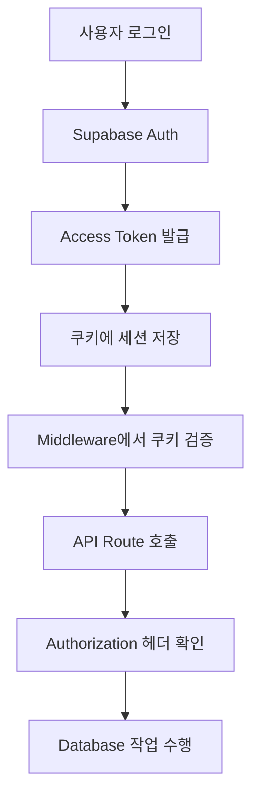

---

### 1. Supabase 인증의 기본 개념

Supabase는 인증(로그인, 로그아웃 등)을 관리하는 강력한 도구입니다. 클라이언트(브라우저)와 서버(Next.js의 API 라우트, SSR)에서 세션을 다루는 방식이 약간 다릅니다. 이를 이해하려면 몇 가지 핵심 개념을 알아야 해요.

### 📌 **세션(Session)이란?**

- 세션은 사용자가 로그인한 상태를 의미합니다. 예를 들어, 사용자가 이메일/비밀번호로 로그인하면 Supabase가 **액세스 토큰**(access token)과 **리프레시 토큰**(refresh token)을 만들어서 사용자를 인증합니다.
- 이 토큰들은 클라이언트(브라우저)와 서버 간에 전달되어 "이 사용자가 로그인했는지" 확인합니다.

### 📌 **클라이언트 vs 서버에서의 세션 관리**

- **클라이언트(브라우저)**: Supabase는 세션 데이터를 **localStorage** 또는 **쿠키**에 저장해서 로그인 상태를 유지합니다. 브라우저에서 Supabase 클라이언트를 사용하면 자동으로 세션을 관리해줍니다.
- **서버(Next.js API 라우트, SSR)**: 서버는 브라우저가 보내는 **쿠키**를 통해 세션을 확인합니다. 서버는 localStorage에 접근할 수 없기 때문에, 쿠키에 저장된 Supabase 토큰을 읽어서 세션을 복구합니다.

### 📌 **문제의 핵심**

당신의 코드에서 **클라이언트**에서는 `authStore`로 세션이 잘 관리되고 있지만, **서버(/api/upload/image)**에서 세션이 `null`로 나오는 이유는 **쿠키가 제대로 전달되지 않거나**, 서버가 쿠키를 읽지 못하기 때문입니다.

---

### 2. Supabase 클라이언트의 종류

Supabase는 Next.js에서 사용하는 환경(클라이언트, 서버)에 따라 다른 클라이언트를 제공합니다. 이게 중요한 이유는, 클라이언트와 서버가 세션을 다루는 방식이 다르기 때문이에요.

### 📌 **1) `createClient` (클라이언트용)**

- **용도**: 브라우저에서 사용 (React 컴포넌트, 프론트엔드 코드 등)
- **세션 저장**: `localStorage`에 세션을 저장하거나, 쿠키를 사용할 수 있음
- **예시**: 로그인, 로그아웃, 사용자 정보 가져오기 등
- **당신의 코드**:

  ```tsx
  // Supabase의 클라이언트 생성 도구를 가져옵니다. 이건 브라우저에서 Supabase를 사용하기 위한 기본 도구입니다.
  import { createClient } from '@supabase/supabase-js'

  // Supabase 클라이언트를 만듭니다. 이 클라이언트는 브라우저에서 로그인, 사용자 정보 가져오기 등을 처리합니다.
  const supabase = createClient(
    // Supabase 프로젝트의 URL을 환경 변수에서 가져옵니다. 이건 Supabase 데이터베이스와 연결하는 주소입니다.
    process.env.NEXT_PUBLIC_SUPABASE_URL!,

    // Supabase 프로젝트의 공개 키를 환경 변수에서 가져옵니다. 이 키는 클라이언트에서 Supabase와 통신할 때 필요합니다.
    process.env.NEXT_PUBLIC_SUPABASE_ANON_KEY!,

    // 인증 관련 설정을 정의합니다.
    {
      auth: {
        // true로 설정하면, 로그인 토큰이 만료될 때 자동으로 새 토큰으로 갱신합니다.
        autoRefreshToken: true,

        // true로 설정하면, 로그인 정보를 브라우저(localStorage 또는 쿠키)에 저장해서 페이지를 새로고침해도 로그인 상태를 유지합니다.
        persistSession: true,

        // true로 설정하면, Google 같은 OAuth 로그인 후 URL에 포함된 토큰을 자동으로 감지해서 세션을 설정합니다.
        detectSessionInUrl: true,
      },
    }
  )
  ```

  - 이 설정은 **클라이언트**에서 세션을 잘 관리합니다. 예를 들어, `supabase.auth.getSession()`을 호출하면 로그인된 사용자의 정보를 가져옵니다.
  - 하지만 이 클라이언트는 **서버**에서는 사용할 수 없습니다.

### 📌 **2) `createRouteHandlerClient` (API 라우트용)**

- **용도**: Next.js의 `/api` 라우트에서 사용
- **세션 저장**: 브라우저가 보낸 **쿠키**에서 세션을 복구
- **예시**:

  ```tsx
  // Supabase의 Next.js용 API 라우트 클라이언트를 가져옵니다. 이건 API 라우트에서 Supabase를 사용하기 위한 도구입니다.
  import { createRouteHandlerClient } from '@supabase/auth-helpers-nextjs'

  // Next.js에서 쿠키를 가져오는 도구입니다. 브라우저가 서버로 보낸 쿠키를 읽을 때 사용합니다.
  import { cookies } from 'next/headers'

  // POST 요청을 처리하는 API 라우트 함수입니다. 예: 파일 업로드 요청(/api/upload/image)을 처리합니다.
  export async function POST(req) {
    // 브라우저가 보낸 쿠키를 가져옵니다. 이 쿠키에는 Supabase의 로그인 정보가 들어있을 수 있습니다.
    const cookieStore = cookies()

    // Supabase 클라이언트를 만듭니다. cookieStore를 전달해서 쿠키를 읽을 수 있게 합니다.
    const supabase = createRouteHandlerClient({ cookies: () => cookieStore })

    // Supabase에게 쿠키를 보고 로그인된 사용자의 세션(로그인 정보)을 가져오라고 요청합니다.
    // data: { session }은 로그인된 사용자의 정보(예: 사용자 ID, 이메일 등)를 담고 있습니다.
    const {
      data: { session },
    } = await supabase.auth.getSession()

    // 세션이 없으면(즉, 사용자가 로그인하지 않았거나 쿠키가 없으면) 에러 응답을 보냅니다.
    if (!session) {
      return new Response('인증 필요', { status: 401 }) // 401은 "로그인 필요"라는 뜻입니다.
    }

    // 세션이 있으면(로그인된 사용자라면) 여기서 파일 업로드 같은 작업을 처리합니다.
    // 예: 파일을 Supabase 스토리지에 업로드하거나 다른 작업을 수행.
  }
  ```

  - 이 클라이언트는 **쿠키**를 읽어서 세션을 복구합니다( 브라우저가 보내준 쿠키를 확인해서 사용자가 로그인했는지 알아냅니다.). 하지만 브라우저가 쿠키를 보내지 않으면 `session`이 `null`이 됩니다.

### 📌 **3) `createServerComponentClient` (SSR용)**

- **용도**: Next.js의 `getServerSideProps`나 Server Components에서 사용
- **세션 저장**: 역시 쿠키에서 세션을 복구
- **예시**:

  ```tsx
  // Supabase의 Next.js용 서버 컴포넌트 클라이언트를 가져옵니다. 이건 서버에서 Supabase를 사용하기 위한 도구입니다.
  import { createServerComponentClient } from '@supabase/auth-helpers-nextjs'

  // Next.js에서 쿠키를 가져오는 도구입니다. 브라우저가 서버로 보낸 쿠키를 읽을 때 사용합니다.
  import { cookies } from 'next/headers'

  // 서버에서 실행되는 함수로, 페이지가 로드되기 전에 데이터를 준비합니다.
  export async function getServerSideProps() {
    // Supabase 클라이언트를 만듭니다. cookies()를 사용해 브라우저가 보낸 쿠키를 전달합니다.
    const supabase = createServerComponentClient({ cookies })

    // Supabase에게 쿠키를 보고 로그인된 사용자의 세션(로그인 정보)을 가져오라고 요청합니다.
    // data: { session }은 로그인된 사용자의 정보(예: 사용자 ID, 이메일 등)를 담고 있습니다.
    const {
      data: { session },
    } = await supabase.auth.getSession()

    // 세션 정보를 페이지에 전달해서 프론트엔드에서 사용할 수 있게 합니다.
    return { props: { session } }
  }
  ```

### 📌 **4) `createMiddlewareClient` (미들웨어용)**

- **용도**: Next.js의 `middleware.ts`에서 세션을 복구하고 모든 요청에 세션을 유지
- **세션 저장**: 쿠키 기반
- **예시**:

  ```tsx
  // Supabase의 Next.js용 미들웨어 클라이언트를 가져옵니다. 이건 Next.js의 미들웨어에서 Supabase 세션을 관리하는 도구입니다.
  import { createMiddlewareClient } from '@supabase/auth-helpers-nextjs'

  // Next.js에서 요청과 응답을 다루는 도구입니다. 요청(req)은 브라우저에서 오는 정보, 응답(res)은 서버가 보내는 결과입니다.
  import { NextRequest, NextResponse } from 'next/server'

  // 미들웨어 함수입니다. 모든 페이지나 API 요청이 서버에 도달하기 전에 이 함수가 실행됩니다.
  export async function middleware(req: NextRequest) {
    // 다음 단계로 요청을 넘기기 위해 기본 응답 객체를 만듭니다. 이건 요청을 계속 처리하도록 허용합니다.
    const res = NextResponse.next()

    // Supabase 미들웨어 클라이언트를 만듭니다. 요청(req)과 응답(res)을 전달해서 쿠키를 읽고 세션을 관리할 수 있게 합니다.
    const supabase = createMiddlewareClient({ req, res })

    // Supabase에게 브라우저가 보낸 쿠키를 보고 로그인된 사용자의 세션(로그인 정보)을 복구하라고 요청합니다.
    await supabase.auth.getSession() // 이 과정에서 쿠키에 있는 로그인 정보를 확인합니다.

    // 모든 작업이 끝난 후, 요청을 다음 단계(페이지나 API)로 넘깁니다.
    return res
  }

  // 미들웨어 설정입니다. 이 설정은 미들웨어가 적용될 경로를 지정합니다.
  export const config = {
    // '_next' (Next.js 내부 파일)와 'favicon.ico'를 제외한 모든 경로에 미들웨어를 적용합니다.
    // 즉, 모든 페이지와 API 요청에서 세션을 자동으로 복구합니다.
    matcher: ['/((?!_next|favicon.ico).*)'],
  }
  ```

  - 이 미들웨어는 **모든 요청**에서 Supabase 세션을 복구해서 서버와 클라이언트 간 세션 연결을 매끄럽게 합니다.

---

## `createServerComponentClient`와 `createRouteHandlerClient`의 차이

### 1. **공통점**

- 둘 다 **서버**에서 Supabase 세션을 복구합니다.
- 둘 다 **쿠키**를 읽어서 로그인된 사용자의 세션 정보를 가져옵니다.
- Supabase의 `@supabase/auth-helpers-nextjs` 패키지에서 제공됩니다.

---

### 2. **차이점**

`createServerComponentClient`와 `createRouteHandlerClient`는 Next.js에서 실행되는 **컨텍스트**(어디서 실행되는지)와 **용도**가 다릅니다.

### 📌 **1) `createServerComponentClient` (SSR용)**

- **용도**:
  - Next.js의 **Server Components** 또는 **getServerSideProps**에서 사용됩니다.
  - **Server Components**는 Next.js 13+의 App Router에서 서버에서 렌더링되는 컴포넌트입니다.
  - **getServerSideProps**는 Pages Router에서 페이지를 서버에서 렌더링할 때 데이터를 준비하는 함수입니다.
- **언제 쓰나?**:
  - 웹페이지(HTML)를 서버에서 렌더링하기 전에, 로그인된 사용자의 정보를 가져와서 페이지에 데이터를 전달할 때 사용.
  - 예: 사용자가 `/profile` 페이지에 접속하면, 서버에서 사용자 정보를 미리 가져와서 페이지에 표시.
- **특징**:
  - 주로 **페이지 렌더링**과 관련된 작업에 사용됩니다.
  - 세션을 복구해서 페이지에 필요한 데이터를 준비합니다.
- **예시**:

  ```tsx
  import { createServerComponentClient } from '@supabase/auth-helpers-nextjs'
  import { cookies } from 'next/headers'

  // getServerSideProps (Pages Router)에서 사용
  export async function getServerSideProps() {
    const supabase = createServerComponentClient({ cookies })
    const {
      data: { session },
    } = await supabase.auth.getSession()

    return { props: { session } } // 세션 정보를 페이지로 전달
  }
  ```

  - 이 코드는 페이지를 렌더링하기 전에 서버에서 세션을 확인하고, 로그인된 사용자 정보를 프론트엔드로 보냅니다.

### 📌 **2) `createRouteHandlerClient` (API 라우트용)**

- **용도**:
  - Next.js의 **API 라우트**(`/api/*`)에서 사용됩니다.
  - API 라우트는 클라이언트(브라우저)가 서버에 요청을 보냈을 때, 데이터를 처리하거나 응답을 보내는 엔드포인트입니다.
- **언제 쓰나?**:
  - 클라이언트가 `/api/upload/image` 같은 API를 호출할 때, 서버에서 세션을 확인하고 데이터를 처리할 때 사용.
  - 예: 파일 업로드, 데이터 저장, 삭제 등 API 요청을 처리할 때.
- **특징**:
  - 주로 **API 요청 처리**에 사용됩니다.
  - 클라이언트가 보낸 요청에 따라 세션을 확인하고, 작업(예: 파일 업로드)을 수행합니다.
- **예시**:

  ```tsx
  import { createRouteHandlerClient } from '@supabase/auth-helpers-nextjs'
  import { cookies } from 'next/headers'

  // API 라우트 (/api/upload/image)
  export async function POST(req) {
    const cookieStore = cookies()
    const supabase = createRouteHandlerClient({ cookies: () => cookieStore })
    const {
      data: { session },
    } = await supabase.auth.getSession()

    if (!session) {
      return new Response('인증 필요', { status: 401 })
    }
    // 세션이 있으면 파일 업로드 처리
  }
  ```

  - 이 코드는 클라이언트가 API를 호출했을 때 세션을 확인하고, 로그인된 사용자라면 파일 업로드를 진행합니다.

---

### 3. **왜 `createServerComponentClient`는 SSR용인가?**

- \*SSR(Server-Side Rendering)**은 서버에서 웹페이지의 HTML을 미리 만들어서 브라우저에 보내는 방식입니다. `createServerComponentClient`는 이런 **페이지 렌더링 과정\*\*에서 세션을 복구해서 사용자 데이터를 페이지에 포함시키는 데 최적화되어 있습니다.
- 반면, `createRouteHandlerClient`는 **API 요청**을 처리하는 데 특화되어 있습니다. API는 주로 데이터를 주고받거나 작업(예: 파일 업로드)을 수행하는 데 사용되므로, 페이지 렌더링과는 목적이 다릅니다.
- **기술적 차이**:
  - `createServerComponentClient`는 Server Components나 `getServerSideProps` 같은 **페이지 렌더링 환경**에서 쿠키를 처리하도록 설계되었습니다.
  - `createRouteHandlerClient`는 `/api` 경로에서 요청과 응답을 다루는 **API 핸들러**에 맞춰 설계되었습니다.

---

### 4. **비유로 쉽게 이해하기**

- **집에 비유**:
  - `createServerComponentClient`는 집(웹페이지)을 꾸미기 전에, 집주인(사용자)이 누구인지 확인하는 역할입니다. 집을 준비(렌더링)하면서 주인 정보를 페이지에 반영합니다.
  - `createRouteHandlerClient`는 집에 찾아온 손님(클라이언트 요청)이 주인인지 확인하고, 손님이 요청한 일(예: 물건 배달, 파일 업로드)을 처리하는 역할입니다.
- **학교에 비유**:
  - `createServerComponentClient`는 수업(페이지)을 시작하기 전에 선생님이 학생(사용자)의 출석을 확인하는 과정입니다.
  - `createRouteHandlerClient`는 학생이 선생님께 질문(API 요청)을 던졌을 때, 선생님이 학생이 맞는지 확인하고 답변을 주는 과정입니다.

---

### 5. **주요 차이 정리**

| 항목          | `createServerComponentClient`                                | `createRouteHandlerClient`                         |
| ------------- | ------------------------------------------------------------ | -------------------------------------------------- |
| **용도**      | SSR (페이지 렌더링, Server Components, `getServerSideProps`) | API 라우트 (`/api/*`)                              |
| **사용 위치** | 페이지 데이터 준비 (예: `/profile` 페이지)                   | API 요청 처리 (예: `/api/upload/image`)            |
| **목적**      | 페이지에 사용자 데이터를 포함해 렌더링                       | 클라이언트 요청 처리 (데이터 저장, 파일 업로드 등) |
| **세션 복구** | 쿠키에서 세션 복구                                           | 쿠키에서 세션 복구                                 |
| **예시 환경** | `getServerSideProps`, Server Components                      | `POST /api/upload/image`                           |

---

### 6. **왜 둘 다 필요할까?**

Next.js는 두 가지 주요 작업을 합니다:

1. **페이지 렌더링(SSR)**: 사용자에게 웹페이지를 보여주기 위해 서버에서 HTML을 만듭니다. 이때 `createServerComponentClient`를 사용해 세션을 확인하고 페이지를 준비합니다.
2. **API 요청 처리**: 클라이언트가 데이터를 보내거나 요청할 때(예: 파일 업로드), 서버에서 작업을 처리합니다. 이때 `createRouteHandlerClient`를 사용해 세션을 확인합니다.

이 두 환경은 서로 다른 구조를 가지므로, Supabase는 각각에 맞는 클라이언트를 제공합니다.

---

### 7. **당신의 경우**

- 당신이 `/api/upload/image`에서 세션이 `null`로 나오는 문제를 겪고 있다면, 이는 `createRouteHandlerClient`를 사용하는 API 라우트 문제입니다. 하지만 페이지 렌더링(예: `/profile`)에서 세션을 확인하려면 `createServerComponentClient`를 사용해야 합니다.
- 두 클라이언트 모두 **쿠키**를 읽어서 세션을 복구하므로, 쿠키가 제대로 전송되지 않으면 둘 다 `session`이 `null`이 될 수 있습니다. 따라서 `fetch` 요청에 `credentials: 'include'`를 추가하고, `middleware.ts`를 설정하는 것이 중요합니다.

---

궁금한 점 있으면 언제든 말해주세요! 😊 더 자세히 설명하거나, 특정 코드 예시를 추가로 드릴 수도 있습니다!

---

### 3. 왜 서버에서 세션이 `null`인가?

당신의 `/api/upload/image`에서 세션이 `null`로 나오는 이유는 다음과 같습니다:

1. **클라이언트가 쿠키를 보내지 않음**:
   - 브라우저가 `/api/upload/image`로 요청을 보낼 때, Supabase의 세션 쿠키(`sb-access-token`, `sb-refresh-token`)가 포함되어야 합니다.
   - 하지만 `fetch` 요청에 `credentials: 'include'`가 없으면 쿠키가 전송되지 않습니다.
2. **서버가 쿠키를 제대로 읽지 못함**:
   - 서버에서 `createRouteHandlerClient`를 올바르게 사용했더라도, 브라우저가 쿠키를 보내지 않으면 세션을 복구할 수 없습니다.
3. **미들웨어가 없음**:
   - Next.js의 `middleware.ts`가 없으면, 서버가 Supabase 세션을 자동으로 유지하지 못할 수 있습니다. 특히 SSR이나 API 라우트에서 세션이 끊길 가능성이 높습니다.
4. **도메인/포트 문제**:
   - 프론트엔드(예: `localhost:3000`)와 백엔드(예: `localhost:3001`)가 다른 도메인이나 포트에서 실행 중이라면, 쿠키가 제대로 전달되지 않을 수 있습니다. 이 경우 **CORS 설정**이 필요합니다.

---

### 4. 해결 방법 (초보자도 쉽게 따라 할 수 있게)

문제를 해결하려면 다음 단계를 하나씩 따라 해보세요.

### 📌 **1) 클라이언트에서 쿠키 전송 확인**

브라우저에서 `/api/upload/image`로 요청할 때 쿠키가 전송되도록 해야 합니다.

```tsx
// 클라이언트 코드 (예: React 컴포넌트)
async function uploadImage(formData) {
  const response = await fetch('/api/upload/image', {
    method: 'POST',
    body: formData,
    credentials: 'include', // ⭐️ 이 줄이 반드시 필요!
  })
  return response.json()
}
```

- `credentials: 'include'`는 브라우저가 쿠키를 서버로 보내도록 합니다.
- **확인 방법**: 브라우저 DevTools → Network 탭 → `/api/upload/image` 요청 → Request Headers → `Cookie`에 `sb-access-token` 등이 있는지 확인하세요.

### 📌 **2) 서버에서 세션 복구 확인**

`/api/upload/image`에서 `createRouteHandlerClient`를 사용해 세션을 복구합니다.

```tsx
// pages/api/upload/image.ts
import { createRouteHandlerClient } from '@supabase/auth-helpers-nextjs'
import { cookies } from 'next/headers'

export async function POST(req) {
  const cookieStore = cookies()
  const supabase = createRouteHandlerClient({ cookies: () => cookieStore })
  const {
    data: { session },
    error,
  } = await supabase.auth.getSession()

  if (error || !session) {
    return new Response('인증 필요', { status: 401 })
  }

  // 세션이 있으면 파일 업로드 처리
  const user = session.user
  // ... 파일 업로드 로직 ...
}
```

- 이 코드는 쿠키에서 세션을 복구합니다. 하지만 쿠키가 없으면 `session`이 `null`이 됩니다.

### 📌 **3) `middleware.ts` 추가 (강력 추천)**

Next.js의 미들웨어를 추가하면 모든 요청에서 세션을 자동으로 복구해서 문제를 줄일 수 있습니다.

```tsx
// middleware.ts
import { createMiddlewareClient } from '@supabase/auth-helpers-nextjs'
import { NextRequest, NextResponse } from 'next/server'

export async function middleware(req: NextRequest) {
  const res = NextResponse.next()
  const supabase = createMiddlewareClient({ req, res })
  await supabase.auth.getSession() // 세션 복구
  return res
}

export const config = {
  matcher: ['/((?!_next|favicon.ico).*)'], // 모든 경로에 적용
}
```

- 이 미들웨어는 모든 페이지와 API 요청에서 Supabase 세션을 복구합니다.
- **효과**: 클라이언트와 서버 간 세션 연결이 훨씬 안정적입니다.

### 📌 **4) `/auth/callback` 확인**

OAuth 로그인(예: Google 로그인) 후, Supabase는 `/auth/callback`으로 리디렉션합니다. 이 페이지에서 세션을 제대로 설정해야 합니다.

```tsx
// pages/auth/callback.ts
import { createRouteHandlerClient } from '@supabase/auth-helpers-nextjs'
import { cookies } from 'next/headers'
import { NextResponse } from 'next/server'

export async function GET(req) {
  const cookieStore = cookies()
  const supabase = createRouteHandlerClient({ cookies: () => cookieStore })
  await supabase.auth.getSession() // 세션 복구
  return NextResponse.redirect('/dashboard') // 로그인 후 리디렉션
}
```

- 이 코드는 OAuth 로그인 후 세션을 서버에서 복구하고, 클라이언트로 리디렉션합니다.

### 📌 **5) 쿠키 전송 확인**

브라우저 DevTools에서 `/api/upload/image` 요청을 확인하세요:

- **Network 탭** → `/api/upload/image` 요청 → **Request Headers** → `Cookie`에 `sb-access-token`, `sb-refresh-token`이 있는지 확인.
- 없으면:
  - `fetch`에 `credentials: 'include'`가 빠졌거나,
  - Supabase가 쿠키를 설정하지 않았거나,
  - 프론트엔드/백엔드 도메인이 달라서 쿠키가 차단된 경우입니다.

### 📌 **6) 도메인 문제 확인**

프론트엔드와 백엔드가 다른 도메인/포트에서 실행 중이라면 (예: `localhost:3000` vs `localhost:3001`), CORS 설정이 필요합니다.

```tsx
// pages/api/upload/image.ts
export async function POST(req) {
  const cookieStore = cookies()
  const supabase = createRouteHandlerClient({ cookies: () => cookieStore })
  const {
    data: { session },
  } = await supabase.auth.getSession()

  // CORS 헤더 추가
  const headers = {
    'Access-Control-Allow-Origin': '<http://localhost:3000>', // 프론트엔드 도메인
    'Access-Control-Allow-Credentials': 'true',
  }

  if (!session) {
    return new Response('인증 필요', { status: 401, headers })
  }
  // ...
}
```

---

### 5. 체크리스트

문제를 해결하기 위해 다음을 하나씩 확인하세요:

- [ ] **클라이언트 fetch 요청**에 `credentials: 'include'`가 있는지 확인
- [ ] **브라우저 DevTools**에서 `/api/upload/image` 요청의 `Cookie` 헤더 확인
- [ ] **middleware.ts** 추가했는지 확인
- [ ] **/auth/callback**에서 세션 복구 잘 되는지 확인
- [ ] 프론트엔드/백엔드 도메인이 같은지 확인 (예: `localhost:3000`으로 통일)

---

### 6. 전체 흐름 다이어그램

클라이언트와 서버 간 인증 흐름을 간단히 도식화하면:

```
1. 브라우저: 로그인 요청 → Supabase → localStorage/쿠키에 세션 저장
2. 브라우저: /api/upload/image로 요청 (credentials: 'include'로 쿠키 전송)
3. 서버: createRouteHandlerClient로 쿠키 읽기 → 세션 복구
4. middleware.ts: 모든 요청에서 세션 유지
5. /auth/callback: OAuth 후 세션 복구 및 리디렉션

```

---

### 7. 추가 도움

- **필요한 경우**: `/auth/callback` 코드나 `/api/upload/image` 전체 코드를 공유해 주시면, 구체적으로 검토해서 최적화된 해결책을 드릴게요!
- **도식화**: 더 자세한 다이어그램(텍스트 기반)을 원하시면, 인증 흐름을 그림처럼 설명할 수 있습니다.
- **최적화된 템플릿**: Supabase + Next.js 인증 설정 전체를 최적화된 형태로 제공할 수도 있습니다.

궁금한 점 있으면 언제든 말해주세요! 😊

# { Supabase 인증 문제 해결 완전 가이드 }

## 개요

Next.js 14 App Router와 Supabase를 사용한 TalentSwap 프로젝트에서 발생했던 인증 관련 문제들과 해결 과정을 초보자도 이해할 수 있도록 상세히 설명합니다.

## 목차

1. [발생했던 주요 문제들](https://www.notion.so/Supabase-244e683f737e8087a703e83a28db549f#%EB%B0%9C%EC%83%9D%ED%96%88%EB%8D%98-%EC%A3%BC%EC%9A%94-%EB%AC%B8%EC%A0%9C%EB%93%A4)
2. [Supabase 인증 시스템 이해하기](https://www.notion.so/Supabase-244e683f737e8087a703e83a28db549f#supabase-%EC%9D%B8%EC%A6%9D-%EC%8B%9C%EC%8A%A4%ED%85%9C-%EC%9D%B4%ED%95%B4%ED%95%98%EA%B8%B0)
3. [문제별 상세 분석 및 해결 과정](https://www.notion.so/Supabase-244e683f737e8087a703e83a28db549f#%EB%AC%B8%EC%A0%9C%EB%B3%84-%EC%83%81%EC%84%B8-%EB%B6%84%EC%84%9D-%EB%B0%8F-%ED%95%B4%EA%B2%B0-%EA%B3%BC%EC%A0%95)
4. [최종 해결책 및 코드 구조](https://www.notion.so/Supabase-244e683f737e8087a703e83a28db549f#%EC%B5%9C%EC%A2%85-%ED%95%B4%EA%B2%B0%EC%B1%85-%EB%B0%8F-%EC%BD%94%EB%93%9C-%EA%B5%AC%EC%A1%B0)
5. [문제 해결 체크리스트](https://www.notion.so/Supabase-244e683f737e8087a703e83a28db549f#%EB%AC%B8%EC%A0%9C-%ED%95%B4%EA%B2%B0-%EC%B2%B4%ED%81%AC%EB%A6%AC%EC%8A%A4%ED%8A%B8)
6. [베스트 프랙티스](https://www.notion.so/Supabase-244e683f737e8087a703e83a28db549f#%EB%B2%A0%EC%8A%A4%ED%8A%B8-%ED%94%84%EB%9E%99%ED%8B%B0%EC%8A%A4)

---

## 발생했던 주요 문제들

### 1. 401 Unauthorized 오류

```
GET /api/profile 401 in 224ms
Error: 인증이 필요합니다

```

### 2. Cookie 파싱 오류

```
TypeError: Cannot read properties of undefined (parsing cookies)
Invalid session data in cookies

```

### 3. Database 권한 오류 (42501)

```
Error: permission denied for table "profiles"
Code: 42501 - Insufficient privilege

```

### 4. ID 컬럼 NULL 오류 (23502)

```
Error: null value in column "id" violates not-null constraint
Code: 23502 - not_null_violation

```

---

## Supabase 인증 시스템 이해하기

### 기본 개념

### 1. 인증 방식의 종류

- **쿠키 기반 인증**: 브라우저가 자동으로 쿠키를 전송하는 방식
- **Authorization 헤더**: API 요청 시 `Bearer token` 형태로 전송하는 방식

### 2. @supabase/ssr 패키지의 역할

```tsx
// 🚫 잘못된 방식 - 일반 supabase 클라이언트
import { createClient } from '@supabase/supabase-js'

// ✅ 올바른 방식 - SSR 전용 클라이언트
import { createBrowserClient, createServerClient } from '@supabase/ssr'
```

**@supabase/ssr이 필요한 이유:**

- Next.js의 Server-Side Rendering 환경에서 쿠키를 올바르게 처리
- 브라우저와 서버 간 세션 동기화
- 인증 상태의 일관성 보장

### 3. Next.js Middleware의 역할

- 모든 요청을 가로채서 인증 상태 확인
- 쿠키에서 세션 정보 추출 및 검증
- 보호된 경로에 대한 접근 제어

### 인증 플로우 이해



---

## 문제별 상세 분석 및 해결 과정

### 문제 1: 401 Unauthorized 오류

### 원인 분석

1. **클라이언트-서버 인증 불일치**: 브라우저에서는 로그인되어 있지만, 서버에서는 인증 정보를 읽지 못함
2. **쿠키 설정 문제**: Supabase 세션이 쿠키에 제대로 저장되지 않음
3. **Authorization 헤더 누락**: API 요청 시 토큰이 헤더에 포함되지 않음

### 해결 과정

**1단계: 브라우저 클라이언트 설정 개선**

```tsx
// src/lib/supabase.ts
export const supabase = createBrowserClient<Database>(supabaseUrl, supabaseAnonKey, {
  auth: {
    autoRefreshToken: true, // 토큰 자동 갱신
    persistSession: true, // 세션 유지
    detectSessionInUrl: true, // URL에서 세션 감지
    flowType: 'pkce', // PKCE 플로우 사용
  },
  cookies: {
    get(name: string) {
      if (typeof document === 'undefined') return undefined
      const cookies = document.cookie.split(';')
      for (const cookie of cookies) {
        const parts = cookie.trim().split('=')
        if (parts[0] === name) {
          return parts[1]
        }
      }
      return undefined
    },
    set(name: string, value: string, options: any) {
      if (typeof document === 'undefined') return
      let cookieString = `${name}=${value}`
      if (options?.maxAge) cookieString += `; max-age=${options.maxAge}`
      if (options?.path) cookieString += `; path=${options.path}`
      if (options?.domain) cookieString += `; domain=${options.domain}`
      document.cookie = cookieString
    },
    remove(name: string, options: any) {
      if (typeof document === 'undefined') return
      let cookieString = `${name}=; expires=Thu, 01 Jan 1970 00:00:00 GMT`
      if (options?.path) cookieString += `; path=${options.path}`
      if (options?.domain) cookieString += `; domain=${options.domain}`
      document.cookie = cookieString
    },
  },
})
```

**2단계: API Route에서 이중 인증 체크**

```tsx
// src/app/api/profile/route.ts
export async function GET(request: NextRequest) {
  try {
    // 1. Authorization 헤더 확인
    const authHeader = request.headers.get('authorization')

    // 2. 쿠키에서 세션 확인
    const cookieStore = await cookies()
    const supabase = createServerClient(
      process.env.NEXT_PUBLIC_SUPABASE_URL!,
      process.env.NEXT_PUBLIC_SUPABASE_ANON_KEY!,
      {
        cookies: {
          get(name: string) {
            return cookieStore.get(name)?.value
          },
        },
        global: {
          // Authorization 헤더가 있으면 우선 사용
          headers: authHeader ? { Authorization: authHeader } : undefined,
        },
      }
    )

    const {
      data: { user },
      error: authError,
    } = await supabase.auth.getUser()

    if (authError || !user) {
      return NextResponse.json({ error: '인증이 필요합니다' }, { status: 401 })
    }

    // 프로필 처리 로직...
  } catch (error) {
    // 에러 처리...
  }
}
```

**3단계: AuthStore에서 토큰 포함한 API 호출**

```tsx
// src/stores/authStore.ts
refreshProfile: async () => {
  try {
    const { user } = get()
    if (!user) return

    // 세션에서 토큰 가져오기
    const {
      data: { session },
    } = await supabase.auth.getSession()
    if (!session) return

    const response = await fetch('/api/profile', {
      method: 'GET',
      headers: {
        Authorization: `Bearer ${session.access_token}`, // 중요!
      },
      credentials: 'include', // 쿠키도 함께 전송
    })

    // 응답 처리...
  } catch (error) {
    // 에러 처리...
  }
}
```

### 문제 2: Cookie 파싱 오류

### 원인 분석

1. **Middleware 설정 오류**: 쿠키를 올바르게 읽고 쓰지 못함
2. **쿠키 형식 불일치**: Supabase가 기대하는 쿠키 형식과 다름
3. **서버-클라이언트 동기화 실패**: 쿠키 변경사항이 응답에 반영되지 않음

### 해결 과정

**올바른 Middleware 구현**

```tsx
// middleware.ts
export async function middleware(request: NextRequest) {
  let response = NextResponse.next({
    request: {
      headers: request.headers,
    },
  })

  const supabase = createServerClient(
    process.env.NEXT_PUBLIC_SUPABASE_URL!,
    process.env.NEXT_PUBLIC_SUPABASE_ANON_KEY!,
    {
      cookies: {
        get(name: string) {
          return request.cookies.get(name)?.value
        },
        set(name: string, value: string, options: any) {
          // 요청과 응답 모두에 쿠키 설정
          request.cookies.set({ name, value, ...options })
          response = NextResponse.next({
            request: {
              headers: request.headers,
            },
          })
          response.cookies.set({ name, value, ...options })
        },
        remove(name: string, options: any) {
          // 요청과 응답 모두에서 쿠키 제거
          request.cookies.set({ name, value: '', ...options })
          response = NextResponse.next({
            request: {
              headers: request.headers,
            },
          })
          response.cookies.set({ name, value: '', ...options })
        },
      },
    }
  )

  // 세션 새로고침으로 쿠키 동기화
  const {
    data: { user },
  } = await supabase.auth.getUser()

  return response
}
```

### 문제 3: Database 권한 오류 (42501)

### 원인 분석

1. **RLS vs 테이블 권한 혼동**: Row Level Security와 PostgreSQL 테이블 권한은 다른 개념
2. **Prisma와 Supabase 클라이언트 혼용**: 서로 다른 권한 컨텍스트에서 작동
3. **Service Role vs Anon Key**: 잘못된 키 사용

### 해결 과정

**RLS와 테이블 권한의 차이점 이해**

```sql
-- 🚫 잘못된 이해: RLS 정책만으로 충분하다고 생각
CREATE POLICY "Users can access own profile" ON profiles
FOR ALL USING (auth.uid() = id);

-- ✅ 올바른 이해: 테이블 권한도 필요
GRANT ALL ON profiles TO authenticated;
GRANT ALL ON profiles TO anon;

-- RLS 정책은 행 단위 접근 제어
ALTER TABLE profiles ENABLE ROW LEVEL SECURITY;

```

**Prisma를 사용한 올바른 해결책**

```tsx
// 문제: Supabase RLS와 Prisma 권한 충돌
// 해결: Prisma를 직접 DB 연결로 사용하되, Supabase 인증 결과 활용

export async function GET(request: NextRequest) {
  // Supabase로 인증 확인
  const {
    data: { user },
    error,
  } = await supabase.auth.getUser()
  if (error || !user) {
    return NextResponse.json({ error: '인증이 필요합니다' }, { status: 401 })
  }

  // Prisma로 직접 DB 작업 (RLS 우회)
  const profile = await prisma.profile.findUnique({
    where: { id: user.id }, // 사용자는 자신의 프로필만 접근
  })

  return NextResponse.json({ data: profile })
}
```

### 문제 4: ID 컬럼 NULL 오류 (23502)

### 원인 분석

1. **Supabase Auth User ID 전달 실패**: 사용자 ID가 프로필 생성 시 전달되지 않음
2. **Profile 생성 시점 문제**: 사용자 등록과 프로필 생성의 타이밍 이슈
3. **Default 값 설정 오류**: Prisma 스키마에서 ID 필드 설정 문제

### 해결 과정

**Profile 생성 헬퍼 함수**

```tsx
// src/lib/profile-helpers.ts
export async function ensureUserProfile(userId: string, email: string | undefined, user: any) {
  try {
    // 기존 프로필 확인
    let profile = await prisma.profile.findUnique({
      where: { id: userId },
    })

    if (!profile) {
      // 프로필이 없으면 생성
      profile = await prisma.profile.create({
        data: {
          id: userId, // 🔑 중요: Supabase User ID를 명시적으로 설정
          email: email,
          displayName: user.user_metadata?.display_name || email?.split('@')[0],
          username: user.user_metadata?.username,
          createdAt: new Date(),
          updatedAt: new Date(),
        },
      })

      console.log('Profile created for user:', userId)
    }

    return profile
  } catch (error) {
    console.error('Error ensuring user profile:', error)
    throw error
  }
}
```

**Prisma 스키마 올바른 설정**

```
// prisma/schema.prisma
model Profile {
  id                String    @id // Supabase Auth User ID (UUID)
  displayName       String?   @map("display_name")
  username          String?   @unique
  email             String?
  // ... 기타 필드들

  // 🔑 중요: @default(cuid()) 사용하지 않음!
  // Supabase Auth User ID를 그대로 사용해야 함

  @@map("profiles")
}

```

---

## 최종 해결책 및 코드 구조

### 1. 완성된 Supabase 클라이언트 설정

```tsx
// src/lib/supabase.ts
import { createBrowserClient } from '@supabase/ssr'
import { Database } from './database.types'

const supabaseUrl = process.env.NEXT_PUBLIC_SUPABASE_URL!
const supabaseAnonKey = process.env.NEXT_PUBLIC_SUPABASE_ANON_KEY!

export const supabase = createBrowserClient<Database>(supabaseUrl, supabaseAnonKey, {
  auth: {
    autoRefreshToken: true,
    persistSession: true,
    detectSessionInUrl: true,
    flowType: 'pkce',
  },
  cookies: {
    get(name: string) {
      if (typeof document === 'undefined') return undefined
      const cookies = document.cookie.split(';')
      for (const cookie of cookies) {
        const parts = cookie.trim().split('=')
        if (parts[0] === name) {
          return parts[1]
        }
      }
      return undefined
    },
    set(name: string, value: string, options: any) {
      if (typeof document === 'undefined') return
      let cookieString = `${name}=${value}`
      if (options?.maxAge) cookieString += `; max-age=${options.maxAge}`
      if (options?.path) cookieString += `; path=${options.path}`
      if (options?.domain) cookieString += `; domain=${options.domain}`
      document.cookie = cookieString
    },
    remove(name: string, options: any) {
      if (typeof document === 'undefined') return
      let cookieString = `${name}=; expires=Thu, 01 Jan 1970 00:00:00 GMT`
      if (options?.path) cookieString += `; path=${options.path}`
      if (options?.domain) cookieString += `; domain=${options.domain}`
      document.cookie = cookieString
    },
  },
})
```

### 2. 안정적인 Middleware 구현

```tsx
// middleware.ts
import { createServerClient } from '@supabase/ssr'
import { NextResponse } from 'next/server'
import type { NextRequest } from 'next/server'

export async function middleware(request: NextRequest) {
  let response = NextResponse.next({
    request: {
      headers: request.headers,
    },
  })

  const supabase = createServerClient(
    process.env.NEXT_PUBLIC_SUPABASE_URL!,
    process.env.NEXT_PUBLIC_SUPABASE_ANON_KEY!,
    {
      cookies: {
        get(name: string) {
          return request.cookies.get(name)?.value
        },
        set(name: string, value: string, options: any) {
          request.cookies.set({ name, value, ...options })
          response = NextResponse.next({
            request: {
              headers: request.headers,
            },
          })
          response.cookies.set({ name, value, ...options })
        },
        remove(name: string, options: any) {
          request.cookies.set({ name, value: '', ...options })
          response = NextResponse.next({
            request: {
              headers: request.headers,
            },
          })
          response.cookies.set({ name, value: '', ...options })
        },
      },
    }
  )

  // 세션 새로고침으로 쿠키 동기화
  const {
    data: { user },
    error: userError,
  } = await supabase.auth.getUser()

  // API 라우트에만 로깅
  if (request.nextUrl.pathname.startsWith('/api/')) {
    console.log(
      `Middleware: ${request.method} ${request.nextUrl.pathname} - User: ${user ? user.id.substring(0, 8) + '...' : 'None'}`
    )
  }

  return response
}

export const config = {
  matcher: ['/((?!_next/static|_next/image|favicon.ico|public).*)'],
}
```

### 3. 견고한 API Route 패턴

```tsx
// src/app/api/profile/route.ts
import { NextRequest, NextResponse } from 'next/server'
import { createServerClient } from '@supabase/ssr'
import { cookies } from 'next/headers'
import { ensureUserProfile } from '@/lib/profile-helpers'
import prisma from '@/lib/prisma'

export async function GET(request: NextRequest) {
  try {
    // 1. Authorization 헤더 확인
    const authHeader = request.headers.get('authorization')

    // 2. 서버 클라이언트 생성
    const cookieStore = await cookies()
    const supabase = createServerClient(
      process.env.NEXT_PUBLIC_SUPABASE_URL!,
      process.env.NEXT_PUBLIC_SUPABASE_ANON_KEY!,
      {
        cookies: {
          get(name: string) {
            return cookieStore.get(name)?.value
          },
          set(name: string, value: string, options: any) {
            // API routes에서는 no-op
          },
          remove(name: string, options: any) {
            // API routes에서는 no-op
          },
        },
        global: {
          headers: authHeader ? { Authorization: authHeader } : undefined,
        },
      }
    )

    // 3. 인증 확인
    const {
      data: { user },
      error: authError,
    } = await supabase.auth.getUser()

    if (authError || !user) {
      return NextResponse.json({ error: '인증이 필요합니다' }, { status: 401 })
    }

    // 4. 프로필 가져오기 (없으면 생성)
    const profile = await ensureUserProfile(user.id, user.email, user)

    // 5. 응답 형식 변환
    const supabaseProfile = {
      id: profile.id,
      username: profile.username,
      display_name: profile.displayName,
      // ... 기타 필드 변환
    }

    return NextResponse.json({
      success: true,
      data: supabaseProfile,
    })
  } catch (error: any) {
    console.error('Error fetching profile:', error)
    return NextResponse.json({ error: '프로필 조회 중 오류가 발생했습니다' }, { status: 500 })
  }
}
```

### 4. 효율적인 AuthStore 구현

```tsx
// src/stores/authStore.ts (핵심 메서드들)
export const useAuthStore = create<AuthState>()(
  persist(
    (set, get) => ({
      // ... 기타 상태들

      refreshProfile: async () => {
        try {
          const { user } = get()
          if (!user) return

          // 세션에서 토큰 가져오기
          const {
            data: { session },
          } = await supabase.auth.getSession()
          if (!session) return

          const response = await fetch('/api/profile', {
            method: 'GET',
            headers: {
              Authorization: `Bearer ${session.access_token}`,
            },
            credentials: 'include',
          })

          if (!response.ok) {
            console.error('Profile fetch error:', await response.text())
            return
          }

          const result = await response.json()

          if (result.success) {
            set({ profile: result.data })
          }
        } catch (error) {
          console.error('Profile refresh error:', error)
        }
      },

      updateProfile: async (updates: Partial<Profile>) => {
        try {
          const { user } = get()
          if (!user) return { error: '로그인이 필요합니다.' }

          const {
            data: { session },
          } = await supabase.auth.getSession()
          if (!session) return { error: '인증이 필요합니다.' }

          const response = await fetch('/api/profile', {
            method: 'PATCH',
            headers: {
              'Content-Type': 'application/json',
              Authorization: `Bearer ${session.access_token}`,
            },
            credentials: 'include',
            body: JSON.stringify(updates),
          })

          if (!response.ok) {
            const errorData = await response.json()
            return { error: errorData.error || 'Profile update failed' }
          }

          await get().refreshProfile()
          return {}
        } catch (error: unknown) {
          return { error: error instanceof Error ? error.message : 'Profile update failed' }
        }
      },
    }),
    {
      name: 'auth-storage',
      partialize: (state) => ({
        user: state.user,
        profile: state.profile,
      }),
    }
  )
)
```

---

## 문제 해결 체크리스트

### 인증 오류 발생 시 확인사항

### 1. 클라이언트 사이드 체크

- [ ] `@supabase/ssr` 패키지가 설치되어 있는가?
- [ ] `createBrowserClient`를 사용하고 있는가?
- [ ] 쿠키 설정이 올바르게 구현되어 있는가?
- [ ] AuthStore에서 토큰을 API 요청에 포함하고 있는가?

### 2. 서버 사이드 체크

- [ ] API Route에서 `createServerClient`를 사용하고 있는가?
- [ ] Authorization 헤더와 쿠키를 모두 확인하고 있는가?
- [ ] `cookies()` 함수를 `await`로 호출하고 있는가?
- [ ] Middleware가 올바르게 설정되어 있는가?

### 3. 데이터베이스 체크

- [ ] Prisma 스키마에서 Profile 모델의 ID 필드가 올바른가?
- [ ] `ensureUserProfile` 함수가 구현되어 있는가?
- [ ] Supabase User ID가 Profile ID로 올바르게 매핑되는가?

### 4. 환경 변수 체크

- [ ] `NEXT_PUBLIC_SUPABASE_URL`이 설정되어 있는가?
- [ ] `NEXT_PUBLIC_SUPABASE_ANON_KEY`가 설정되어 있는가?
- [ ] `DATABASE_URL`이 올바르게 설정되어 있는가?

### 디버깅 도구

```tsx
// 인증 상태 디버깅 헬퍼
export async function debugAuth() {
  const {
    data: { session },
  } = await supabase.auth.getSession()
  const {
    data: { user },
  } = await supabase.auth.getUser()

  console.log('Debug Auth Info:', {
    hasSession: !!session,
    hasUser: !!user,
    userId: user?.id,
    tokenExists: !!session?.access_token,
    expiresAt: session?.expires_at,
    currentTime: Math.floor(Date.now() / 1000),
  })
}

// 쿠키 상태 확인
export function debugCookies() {
  if (typeof document === 'undefined') return

  const cookies = document.cookie.split(';')
  const supabaseCookies = cookies.filter((cookie) => cookie.trim().startsWith('sb-'))

  console.log('Supabase Cookies:', supabaseCookies)
}
```

---

## 베스트 프랙티스

### 1. 코드 구조

### ✅ 좋은 예시

```tsx
// 명확한 역할 분리
;-src / lib / supabase.ts - // 브라우저 클라이언트
  middleware.ts - // 서버 미들웨어
  src / lib / profile -
  helpers.ts - // 프로필 관련 헬퍼
  src / stores / authStore.ts // 인증 상태 관리
```

### 🚫 피해야 할 패턴

```tsx
// 한 파일에서 모든 것을 처리
// 클라이언트와 서버 로직 혼재
// 하드코딩된 인증 로직
```

### 2. 에러 처리

### ✅ 포괄적인 에러 처리

```tsx
try {
  const {
    data: { user },
    error,
  } = await supabase.auth.getUser()

  if (error) {
    console.error('Auth error:', error.message)
    return { error: 'Authentication failed' }
  }

  if (!user) {
    return { error: '로그인이 필요합니다' }
  }

  // 성공 로직...
} catch (error) {
  console.error('Unexpected error:', error)
  return { error: '예상치 못한 오류가 발생했습니다' }
}
```

### 3. 로깅 전략

```tsx
// 프로덕션에서는 민감한 정보 제외
const logAuthEvent = (event: string, details: any) => {
  if (process.env.NODE_ENV === 'development') {
    console.log(`[AUTH] ${event}:`, details)
  } else {
    // 프로덕션에서는 오류만 로깅
    if (details.error) {
      console.error(`[AUTH] ${event} failed:`, details.error)
    }
  }
}
```

### 4. 성능 최적화

```tsx
// 불필요한 API 호출 방지
const debouncedRefreshProfile = debounce(async () => {
  await authStore.refreshProfile()
}, 1000)

// 캐싱 활용
const profileCache = new Map()
const getCachedProfile = (userId: string) => {
  const cached = profileCache.get(userId)
  if (cached && Date.now() - cached.timestamp < 5 * 60 * 1000) {
    return cached.data
  }
  return null
}
```

---

## 마무리

이 가이드에서 다룬 인증 문제들은 Next.js 14와 Supabase를 함께 사용할 때 흔히 발생하는 문제들입니다. 핵심은 다음과 같습니다:

1. **@supabase/ssr 패키지 필수 사용**
2. **클라이언트와 서버 환경의 차이점 이해**
3. **쿠키와 Authorization 헤더 이중 체크**
4. **Prisma와 Supabase 인증의 올바른 조합**
5. **체계적인 에러 처리와 디버깅**

이러한 원칙들을 따르면 안정적이고 확장 가능한 인증 시스템을 구축할 수 있습니다.

---
